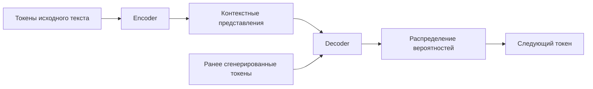
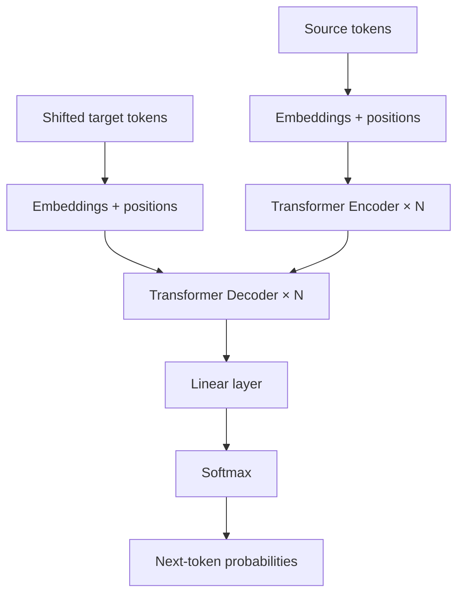
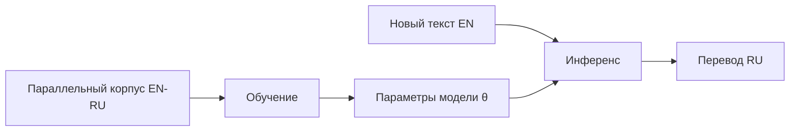

# Раздел 2. Машинный перевод как направление искусственного интеллекта

> **Дисциплина:** «Основы машинного перевода»  
> **Направление:** 44.03.05 «Педагогическое образование (с двумя профилями подготовки)»  
> **Профиль:** «Информатика и английский язык»  
> **Формат:** лекционный материал для GitHub / Moodle  
> **Актуализация:** август 2026 г.

## Аннотация и цели изучения

В разделе машинный перевод рассматривается как классическая задача искусственного интеллекта: система должна построить внутреннее представление исходной последовательности, учесть контекст и породить новую последовательность на другом языке. Прослеживается переход от символических моделей к статистическому обучению, нейронным encoder–decoder-архитектурам и Transformer.

После изучения раздела студент должен:

- объяснять, почему машинный перевод относится к задачам искусственного интеллекта и NLP;
- различать этапы обучения, инференса и декодирования;
- интерпретировать вероятностную модель последовательности;
- понимать назначение эмбеддингов и механизма внимания;
- записывать и содержательно объяснять формулу Self-Attention;
- связывать особенности архитектуры модели с типичными переводческими ошибками.

## Теоретический блок

### 1. Перевод как задача условной генерации

Пусть исходное предложение представлено последовательностью токенов

$$
x=(x_1,x_2,\ldots,x_m),
$$

а перевод — последовательностью

$$
y=(y_1,y_2,\ldots,y_n).
$$

Современная авторегрессионная модель раскладывает условную вероятность перевода следующим образом:

$$
P(y\mid x)=\prod_{t=1}^{n}P(y_t\mid y_{<t},x).
$$

На каждом шаге система прогнозирует следующий токен с учётом исходного текста и уже сгенерированной части перевода. Обучение по параллельному корпусу обычно связано с минимизацией отрицательного логарифмического правдоподобия:

$$
\mathcal{L}_{NLL}=-\sum_{t=1}^{n}\log P(y_t^*\mid y_{<t}^*,x),
$$

где $y_t^*$ — токен эталонного перевода.

### 2. Машинный перевод в истории искусственного интеллекта

| Парадигма | Где хранится знание | Сильная сторона | Основное ограничение |
|---|---|---|---|
| Rule-Based MT | словари и лингвистические правила | интерпретируемость | высокая стоимость ручной разработки |
| Statistical MT | вероятности и таблицы соответствий | обучение на корпусах | ограниченный контекст |
| Neural MT | параметры нейросети | целостное моделирование последовательности | зависимость от качества данных |
| LLM-based MT | предобученная генеративная модель + инструкция | длинный контекст и гибкость | вариативность, риск добавлений и галлюцинаций |

История МП хорошо иллюстрирует общий переход ИИ от явного программирования знаний к обучению представлений на данных.

### 3. Эмбеддинги

После токенизации дискретный идентификатор токена преобразуется в плотный вектор:

$$
\mathbf{e}_i\in\mathbb{R}^{d}.
$$

В Transformer к нему добавляется позиционное представление:

$$
\mathbf{h}_i^{(0)}=\mathbf{e}_i+\mathbf{p}_i.
$$

Эмбеддинг не является словарным определением. Это обучаемое числовое представление, положение которого в многомерном пространстве связано с употреблением токена в данных.

### 4. Encoder–Decoder



**Encoder** кодирует исходную последовательность, а **Decoder** порождает перевод. В Transformer оба компонента строятся из повторяющихся слоёв внимания и feed-forward сетей.

### 5. Self-Attention

Для матрицы входных представлений $X$ вычисляются запросы, ключи и значения:

$$
Q=XW_Q,\qquad K=XW_K,\qquad V=XW_V.
$$

Масштабированное скалярное внимание задаётся формулой:

$$
\operatorname{Attention}(Q,K,V)=
\operatorname{softmax}\left(\frac{QK^T}{\sqrt{d_k}}\right)V.
$$

Матрица

$$
A=\operatorname{softmax}\left(\frac{QK^T}{\sqrt{d_k}}\right)
$$

содержит веса внимания. Элемент $A_{ij}$ показывает, насколько сильно представление позиции $i$ использует информацию позиции $j$ на данном слое и в данной голове.

Рассмотрим предложение:

**EN:** `The teacher told the student that she had passed the exam.`

Для перевода местоимения `she` недостаточно локального окна: необходимо учитывать более широкий контекст и разрешать референцию. Механизм внимания облегчает работу с дальними зависимостями, но сам по себе не гарантирует правильного лингвистического решения.

### 6. Multi-Head Attention

Transformer использует несколько голов внимания:

$$
\operatorname{MultiHead}(Q,K,V)=
\operatorname{Concat}(head_1,\ldots,head_h)W_O.
$$

Разные головы могут фиксировать различные типы зависимостей, однако методически неверно утверждать, что каждая конкретная голова всегда однозначно соответствует определённому синтаксическому правилу.

### 7. Архитектура Transformer



К основным компонентам относятся:

1. Multi-Head Attention;
2. остаточные связи;
3. нормализация;
4. позиционно-независимая feed-forward сеть;
5. маскирование будущих токенов в декодере.

### 8. Декодирование

При жадном декодировании выбирается наиболее вероятный токен:

$$
y_t=\arg\max_w P(w\mid y_{<t},x).
$$

Однако локально лучший выбор не всегда ведёт к лучшей полной последовательности. **Beam search** хранит несколько наиболее вероятных гипотез и развивает их параллельно.

Пример проблемы:

**EN:** `The course runs in the spring term.`

Варианты:

- `Курс работает в весеннем семестре.` — формально возможная, но стилистически неудачная калька;
- `Курс проходит в весеннем семестре.` — естественнее;
- `Курс проводится в весеннем семестре.` — нормативный вариант для официального учебного контекста.

Вероятностный максимум не тождествен переводческой норме.

### 9. Минимальный инференс EN→RU на Python

```python
# pip install transformers sentencepiece torch

from transformers import MarianMTModel, MarianTokenizer

model_name = "Helsinki-NLP/opus-mt-en-ru"
tokenizer = MarianTokenizer.from_pretrained(model_name)
model = MarianMTModel.from_pretrained(model_name)

text = "Machine translation is a challenging task in artificial intelligence."

batch = tokenizer([text], return_tensors="pt", padding=True)
generated = model.generate(
    **batch,
    num_beams=4,
    max_new_tokens=80
)

translation = tokenizer.batch_decode(
    generated,
    skip_special_tokens=True
)[0]

print(translation)
```

Результат необходимо рассматривать как гипотезу, которую проверяют по четырём уровням: **смысл → терминология → грамматика → стиль**.

### 10. Обучение и инференс — разные режимы

На этапе обучения модель видит пары исходных и целевых последовательностей и корректирует параметры $\theta$. На этапе инференса эталонного перевода нет: модель сама выбирает продолжение.



Это различие важно для понимания ошибок: высокая точность на обучающих данных не гарантирует качества на новых доменах.

## Современное состояние и российские решения

**ИСП РАН** рассматривает машинный перевод в общем контексте современной обработки естественного языка: вместе с векторными представлениями, нейронными сетями, синтаксическим анализом и языковыми моделями. Это соответствует современной трактовке MT как частного случая sequence-to-sequence NLP. Материалы курса: <https://tpc.ispras.ru/>.

**Яндекс Переводчик** демонстрирует эволюцию от статистического и гибридного подхода к нейросетевому переводу. В 2024 г. Яндекс сообщил о дообучении переводческой нейросети на высококачественных примерах, подготовленных с использованием YandexGPT, а в декабре 2025 г. — о запуске отдельного ИИ-режима для сложных и длинных текстов на базе больших языковых моделей.  
<https://yandex.ru/company/news/02-07-06-2024>  
<https://yandex.ru/company/news/22-12-2025-02>

**PROMT** представляет другую отечественную траекторию: от систем с развитым лингвистическим компонентом к нейронному машинному переводу и интеграции LLM. Для корпоративных сценариев принципиальны предметная специализация и контролируемая терминология.  
<https://www.promt.ru/press/news/Konferentsiya_PROMT_AI_Day_proshla_v_SanktPeterburge/>

**GigaChat** позволяет задать перевод как управляемую генеративную задачу: в системной инструкции можно потребовать сохранить код, формулы, структуру документа и не добавлять комментарии. Это полезно для изучения prompt-based NLP, но требует контроля результата.  
<https://developers.sber.ru/docs/ru/gigachat/prompts-hub/content/translation>

Конференция **«Диалог»** остаётся одной из основных российских площадок по компьютерной лингвистике и даёт студентам примеры экспериментальных постановок задач, корпусных ресурсов и методов измеримого сравнения NLP-систем: <https://www.dialog-21.ru/>.

## Практические кейсы применения в педагогической деятельности

### Кейс 1. Из «чёрного ящика» в инженерную модель

Студент получает готовый автоматический перевод и должен восстановить вычислительный конвейер:

`текст → токены → эмбеддинги → encoder → attention → decoder → токены → текст`.

Цель — заменить представление о «магическом переводчике» инженерным пониманием процесса.

### Кейс 2. Матрица внимания как учебная модель

Для короткой пары EN→RU студенты вручную строят таблицу соответствий: какие английские слова наиболее значимы при выборе каждого русского слова. После этого преподаватель показывает связь такой таблицы с матрицей $A$ в Self-Attention.

### Кейс 3. Ошибка уверенной модели

Студентам предлагается несколько беглых переводов одного предложения. Необходимо определить, какой вариант лучше передаёт значение и жанр, и объяснить, почему высокая вероятностная уверенность модели не является доказательством адекватности.

### Кейс 4. LLM-перевод с формальными ограничениями

```text
Переведи с английского на русский.
Сохрани Markdown, формулы LaTeX и программный код без изменений.
Термин machine translation всегда переводи как «машинный перевод».
Не добавляй комментарии и не исправляй факты оригинала.
```

Студенты проверяют соблюдение ограничений и классифицируют нарушения.

## Вопросы для самопроверки и дискуссий (5 вопросов)

1. Почему машинный перевод является задачей искусственного интеллекта, а не только автоматической заменой слов по словарю?
2. Как интерпретируется разложение $P(y\mid x)=\prod_tP(y_t\mid y_{<t},x)$?
3. Какую функцию выполняют матрицы $Q$, $K$ и $V$ в механизме Self-Attention?
4. Чем beam search отличается от жадного декодирования?
5. Какие дополнительные риски возникают, когда перевод выполняется универсальной LLM, а не специализированной NMT-моделью?

## Рекомендуемая отечественная литература (до 10 источников)

1. Марчук, Ю. Н. **Компьютерная лингвистика** : учебное пособие / Ю. Н. Марчук. — Москва : АСТ : Восток-Запад, 2007. — 317 с. — ISBN 978-5-17-039480-7.
2. Марчук, Ю. Н. **Проблемы машинного перевода** / Ю. Н. Марчук ; отв. ред. Р. Г. Пиотровский. — Москва : Наука, 1983. — 231 с.
3. Колин, К. К. Искусственный интеллект в технологиях машинного перевода / К. К. Колин, А. А. Хорошилов, Ю. В. Никитин [и др.] // **Социальные новации и социальные науки**. — 2021. — № 2. — С. 64–80. — DOI 10.31249/snsn/2021.02.05.
4. Митренина, О. В. Назад, в 47-й: к 70-летию машинного перевода как научного направления / О. В. Митренина // **Вестник Новосибирского государственного университета. Серия: Лингвистика и межкультурная коммуникация**. — 2017. — Т. 15, № 3. — С. 5–12. — DOI 10.25205/1818-7935-2017-15-3-5-12.
5. Митренина, О. В. Нейронные сети и компьютерная обработка языка / О. В. Митренина // **Journal of Applied Linguistics and Lexicography**. — 2019. — Т. 1, № 2. — С. 399–408.
6. Раренко, М. Б. Машинный перевод как вызов / М. Б. Раренко // **Вестник Московского университета. Серия 22. Теория перевода**. — 2021. — № 2. — С. 117–126.
7. **Прикладная и компьютерная лингвистика** / под ред. И. С. Николаева, О. В. Митрениной, Т. М. Ландо. — Москва : ЛЕНАНД, 2016. — 320 с.
