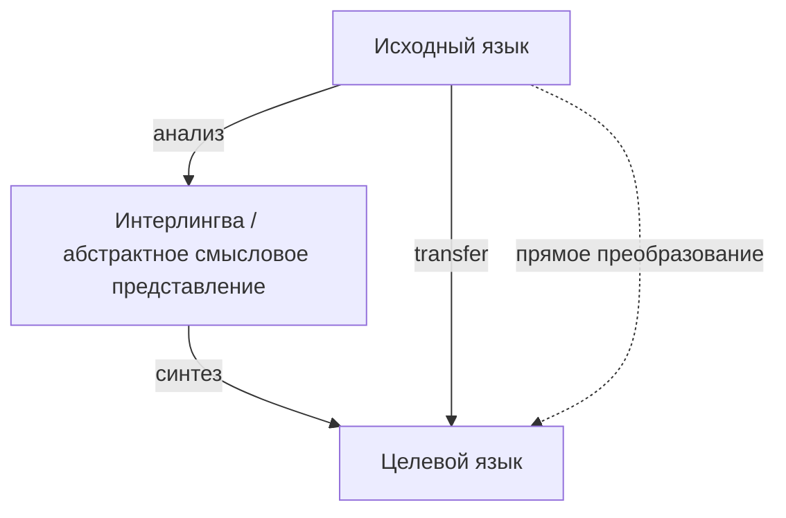
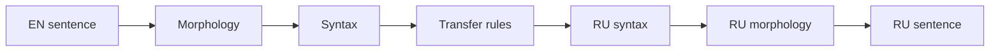
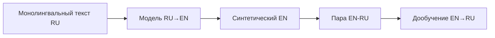

# Раздел 3. Виды и стратегии машинного перевода

> **Дисциплина:** «Основы машинного перевода»  
> **Направление:** 44.03.05 «Педагогическое образование (с двумя профилями подготовки)»  
> **Профиль:** «Информатика и английский язык»  
> **Формат:** лекционный материал для GitHub / Moodle  
> **Актуализация:** август 2026 г.

## Аннотация и цели изучения

Раздел систематизирует основные виды и стратегии машинного перевода: прямой, трансферный и интерлингвальный подходы, RBMT, example-based MT, SMT, NMT, гибридные и LLM-based системы. Параллельно рассматриваются переводческие стратегии человека — конкретизация, генерализация, модуляция, экспликация, компенсация — и анализируется, какие из них современная модель способна воспроизводить автоматически.

После изучения раздела студент должен:

- различать основные архитектурные типы систем МП;
- объяснять принцип работы RBMT, SMT и NMT;
- понимать назначение гибридизации и доменной адаптации;
- классифицировать переводческие трансформации в парах EN→RU;
- объяснять роль back-translation;
- выбирать стратегию перевода терминов и культурно-специфичных единиц.

## Теоретический блок

### 1. Direct, Transfer и Interlingua

Классическая типология систем машинного перевода различает уровни глубины анализа.



- **Direct translation** использует минимальный анализ и преобразует исходные единицы максимально близко к поверхностной форме.
- **Transfer** строит структурное представление исходного предложения и преобразует его в структуру целевого языка.
- **Interlingua** предполагает промежуточное языково-независимое смысловое представление.

Современная многоязычная нейросеть не является классической интерлингвой, хотя её скрытые представления могут частично объединять информацию разных языков.

### 2. Rule-Based Machine Translation

RBMT опирается на словари и явно сформулированные лингвистические правила.



**EN:** `The students are writing a program.`  
**RU:** `Студенты пишут программу.`

Система должна определить число существительного `students`, функцию подлежащего, время и аспект глагольной группы, объект `program`, а затем породить грамматически корректную русскую форму. Английский Continuous при этом не копируется формально.

### 3. Example-Based Machine Translation

EBMT исходит из перевода по аналогии:

> поиск похожего примера → выравнивание фрагментов → адаптация → сборка результата.

Принцип концептуально близок памяти переводов, хотя полноценный EBMT может автоматически комбинировать части нескольких примеров.

### 4. Statistical Machine Translation

В классической статистической постановке использовалась байесовская декомпозиция:

$$
\hat{e}=\arg\max_e P(e\mid f)
=\arg\max_e P(f\mid e)P(e),
$$

где $f$ — исходная фраза, $e$ — перевод.

Компонент $P(f\mid e)$ задаёт модель перевода, а $P(e)$ — языковую модель целевого языка. В phrase-based SMT дополнительно используются таблицы фраз, вероятности перестановок и штрафы длины.

### 5. Neural Machine Translation

NMT обучает единую дифференцируемую модель:

$$
\theta^*=\arg\min_\theta
-\sum_{(x,y)\in D}\log P_\theta(y\mid x).
$$

Ключевое отличие от SMT состоит в том, что представления, контекст и вероятность перевода обучаются совместно, а не собираются из большого числа вручную раздельных компонентов.

### 6. Гибридные системы

В реальной практике типы смешиваются:

- NMT + терминологическая база;
- NMT + translation memory;
- NMT + правила обработки чисел и именованных сущностей;
- LLM + retrieval;
- MT + проверка качества + human review.

Гибридность не является технологическим «компромиссом прошлого». В профессиональной среде она повышает **контролируемость** результата.

### 7. Переводческие стратегии

| Стратегия | Исходный пример | Возможный перевод | Риск автоматизации |
|---|---|---|---|
| Конкретизация | `vehicle` | `автомобиль` | неоправданное сужение значения |
| Генерализация | `oak` | `дерево` | потеря специфики |
| Модуляция | `You are welcome` | `Пожалуйста` | буквальная калька |
| Экспликация | `GCSE` | `экзамены GCSE` + пояснение | непонятная реалия |
| Компенсация | игра слов | иной стилистический приём | потеря эффекта |
| Транслитерация | `TensorFlow` | `TensorFlow` | ошибочная русификация имени |

Для будущего учителя английского языка важно различать **формальное соответствие** и **функциональную эквивалентность**.

### 8. Стратегия перевода терминов

Для научного и учебного текста целесообразен следующий порядок:

1. утверждённый термин из глоссария;
2. устойчивый вариант из профильного корпуса;
3. вариант, закреплённый в научной литературе;
4. калькирование или описательный перевод;
5. сохранение оригинала с пояснением.

Например:

`attention mechanism` → `механизм внимания`;

`learning management system` → `система управления обучением`.

При автоматическом переводе терминологический приоритет следует задавать явно.

### 9. Back-translation

Обратный перевод широко применяется для синтетического расширения параллельных данных.



Если имеется большой корпус русских текстов, модель RU→EN создаёт синтетические английские источники, которые затем используются вместе с настоящими русскими целевыми текстами.

Важно: обратный перевод **не является надёжной оценкой качества сам по себе**. Ошибка первого перевода может быть случайно компенсирована второй моделью.

### 10. Доменная стратегия

Одна и та же строка может требовать разных переводов:

**EN:** `cell`

- `ячейка` — электронные таблицы;
- `клетка` — биология;
- `элемент` — электрохимия;
- `камера` — тюремный контекст.

Поэтому профессиональные системы применяют domain adaptation, fine-tuning, терминологические ограничения, retrieval и постредактирование.

### 11. Strategy prompting для LLM

```text
Ты переводишь учебно-научный текст EN→RU.
Стратегия:
1. Сохраняй терминологию из глоссария.
2. Не калькируй английские синтаксические конструкции.
3. Не добавляй объяснения, которых нет в оригинале.
4. Сохраняй неопределённость исходника, если контекст её не разрешает.
5. Не переводи имена библиотек и названия API.
```

Такой промпт превращает часть переводческой стратегии в формализованную инструкцию, но не гарантирует её соблюдение без QA.

## Современное состояние и российские решения

**PROMT** особенно нагляден при обсуждении эволюции и гибридности машинного перевода: отечественная технология развивалась от систем с сильным лингвистическим компонентом к нейронному переводу, предметной специализации и интеграции LLM. Для курса PROMT позволяет показать, что правила, терминология и нейронные методы могут сосуществовать в одной производственной системе.

**Яндекс Переводчик** также отражает смену парадигм: статистический перевод → гибрид статистической и нейронной моделей → нейронные технологии → использование YandexGPT для подготовки данных → отдельный LLM-режим для сложного контекста.  
<https://yandex.ru/company/news/2017-0914>  
<https://yandex.ru/company/news/02-07-06-2024>  
<https://yandex.ru/company/news/22-12-2025-02>

**Smartcat** демонстрирует прикладную гибридную стратегию: AI/MT сочетается с translation memory, пользовательскими глоссариями и экспертным редактированием. Такой workflow особенно важен для профессионального перевода, где качество определяется не только моделью, но и организацией процесса.  
<https://ru.smartcat.com/ai-translator/>

**GigaChat** позволяет формулировать переводческую стратегию естественным языком — через системную инструкцию. Это удобно для сохранения Markdown, терминов и стилистических требований, но требует проверки соблюдения ограничений.  
<https://developers.sber.ru/docs/ru/gigachat/prompts-hub/content/translation>

В отечественных исследованиях всё больше внимания уделяется постредактированию и взаимодействию человека с системой. Вместо бинарной схемы «машина или переводчик» современный процесс строится как последовательность **автоматизация → проверка → целенаправленная человеческая правка**.

## Практические кейсы применения в педагогической деятельности

### Кейс 1. Определение переводческой стратегии

Студенты получают 12 пар EN→RU и для каждой определяют применённую стратегию: конкретизация, генерализация, модуляция, экспликация, перестановка, опущение или компенсация. После этого анализируют, совпадает ли стратегия человека со стратегией MT-системы.

### Кейс 2. RBMT против NMT

Для предложений с фразовыми глаголами, многозначностью, согласованием и длинными синтаксическими зависимостями студент прогнозирует, где явное правило может дать преимущество, а где нейронная модель лучше использует контекст.

### Кейс 3. Контролируемый школьный глоссарий

```python
glossary = {
    "branching": "ветвление",
    "loop": "цикл",
    "flowchart": "блок-схема",
    "condition": "условие",
}
```

Студенты переводят фрагмент урока по алгоритмизации и проверяют, соблюдается ли терминологическая политика.

### Кейс 4. Back-translation как критическое упражнение

Цепочка EN→RU→EN выполняется разными системами. Студенты отмечают, какие значения исчезли, добавились или изменились. Главный методический вывод: сходство обратного текста с исходником не доказывает корректность промежуточного перевода.

## Вопросы для самопроверки и дискуссий

1. В чём различие direct, transfer и interlingua-подходов?
2. Почему SMT обычно разделяло модель перевода и языковую модель, а NMT обучает представления совместно?
3. В каких задачах гибридная система может быть предпочтительнее «чистой» NMT?
4. Какие переводческие трансформации особенно трудно воспроизводятся автоматически и почему?
5. Почему back-translation полезен для обучения моделей, но ограничен как способ оценки качества?

## Рекомендуемая отечественная литература
1. Марчук, Ю. Н. **Модели перевода** : учебное пособие / Ю. Н. Марчук. — Москва : Академия, 2010. — 176 с. — ISBN 978-5-7695-6991-3.
2. Марчук, Ю. Н. **Проблемы машинного перевода** / Ю. Н. Марчук ; отв. ред. Р. Г. Пиотровский. — Москва : Наука, 1983. — 231 с.
3. Баранов, А. Н. **Введение в прикладную лингвистику** / А. Н. Баранов. — 5-е изд. — Москва : URSS, 2017. — 367 с. — ISBN 978-5-9710-4237-2.
4. Раренко, М. Б. Машинный перевод: от перевода «по правилам» к нейронному переводу / М. Б. Раренко // **Социальные и гуманитарные науки. Отечественная и зарубежная литература. Серия: Языкознание**. — 2021. — № 3. — С. 70–79. — DOI 10.31249/ling/2021.03.05.
5. Камшилова, О. Н. Машинный перевод в эпоху цифровизации: новые практики, процедуры и ресурсы / О. Н. Камшилова, Л. Н. Беляева // **Terra Linguistica**. — 2023. — Т. 14, № 1. — С. 41–56. — DOI 10.18721/JHSS.14105.
6. Овчинникова, И. Г. Использование компьютерных переводческих инструментов: новые возможности, новые ошибки / И. Г. Овчинникова // **Russian Journal of Linguistics**. — 2019. — Т. 23, № 2. — С. 544–561. — DOI 10.22363/2312-9182-2019-23-2-544-561.
7. Фатюшина, Е. Ю. Машинный перевод технического текста: современное состояние и перспективы / Е. Ю. Фатюшина, О. Ю. Семина // **Актуальные вопросы современной филологии и журналистики**. — 2024. — № 3 (54). — С. 38–47. — DOI 10.36622/2587-9510.2024.54.3.004.
