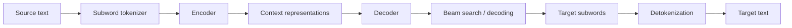
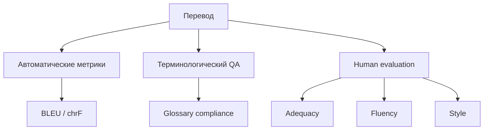
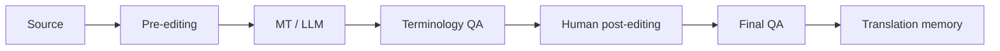

# Раздел 4. Современный машинный перевод

> **Дисциплина:** «Основы машинного перевода»  
> **Направление:** 44.03.05 «Педагогическое образование (с двумя профилями подготовки)»  
> **Профиль:** «Информатика и английский язык»  
> **Формат:** лекционный материал для GitHub / Moodle  
> **Актуализация:** август 2026 г.

## Аннотация и цели изучения

Раздел посвящён современному нейронному машинному переводу: субсловной токенизации, Transformer, многоязычным моделям, адаптации к предметной области, LLM-based translation, автоматической оценке BLEU/chrF и постредактированию. Особое внимание уделяется принципу: высокая беглость автоматически сгенерированного текста не равна его фактической, терминологической и переводческой корректности.

После изучения раздела студент должен:

- объяснять назначение BPE и SentencePiece;
- понимать современный NMT-конвейер на основе Transformer;
- различать многоязычное обучение и доменную адаптацию;
- рассчитывать и интерпретировать BLEU и chrF;
- понимать преимущества и ограничения LLM-based translation;
- различать light post-editing и full post-editing.

## Теоретический блок

### 1. Субсловная токенизация

Полнословный словарь плохо масштабируется на редкие формы, имена, неологизмы и богатую морфологию. Поэтому современные NMT-модели чаще работают с субсловными единицами.

Условный разбор:

```text
internationalization
inter national ization

переобучение
пере обуч ение
```

**Byte Pair Encoding (BPE)** начинает с малых единиц и итеративно объединяет наиболее частые пары. **SentencePiece** может обучаться непосредственно на исходной строке и не требует заранее заданной токенизации по словам.

Преимущества субсловного подхода:

- практически открытый словарь;
- устойчивость к редким словам;
- возможность переиспользовать части слов;
- ограниченный размер vocabulary.

Ограничения:

- токен перестаёт совпадать со словом;
- число токенов может значительно расти;
- границы субслов не обязаны совпадать с морфемами.

### 2. BPE: упрощённая логика

Пусть корпус содержит последовательности символов. На каждой итерации выбирается самая частая соседняя пара $(a,b)$ и заменяется объединённой единицей $ab$.

```python
from collections import Counter

words = [
    ("l", "o", "w", "</w>"),
    ("l", "o", "w", "e", "r", "</w>"),
    ("n", "e", "w", "e", "s", "t", "</w>"),
]

pairs = Counter()
for word in words:
    pairs.update(zip(word, word[1:]))

print(pairs.most_common(5))
```

Этот пример демонстрирует принцип подсчёта пар, но промышленный tokenizer содержит более сложную нормализацию и алгоритм построения словаря.

### 3. Transformer как базовая архитектура NMT

Механизм внимания:

$$
\operatorname{Attention}(Q,K,V)=
\operatorname{softmax}\left(\frac{QK^T}{\sqrt{d_k}}\right)V.
$$

В отличие от ранних RNN-моделей, Transformer способен параллельно обрабатывать позиции при обучении и эффективно моделировать дальние зависимости.



### 4. Многоязычные модели

Одна модель может переводить множество пар языков:

$$
P(y\mid x,l_s,l_t),
$$

где $l_s$ и $l_t$ — признаки исходного и целевого языка.

Преимущества:

- перенос знаний между языками;
- единая инфраструктура;
- помощь низкоресурсным языкам за счёт multilingual transfer.

Ограничение: качество редкой языковой пары может уступать специализированной модели, особенно при несбалансированном корпусе.

### 5. Domain Adaptation

Общая модель должна разрешать термин в зависимости от предметной области.

**EN:** `cell`

| Домен | Перевод |
|---|---|
| spreadsheets | ячейка |
| biology | клетка |
| batteries | элемент |
| prison context | камера |

Для адаптации применяются:

- fine-tuning на тематическом корпусе;
- терминологические ограничения;
- retrieval из translation memory;
- prompt conditioning;
- адаптеры и LoRA;
- human feedback.

### 6. Метрика BLEU

BLEU использует модифицированную точность n-грамм и штраф за чрезмерно короткий перевод:

$$
BLEU=BP\cdot
\exp\left(\sum_{n=1}^{N}w_n\log p_n\right).
$$

Brevity penalty:

$$
BP=
\begin{cases}
1, & c>r,\\
e^{1-r/c}, & c\le r,
\end{cases}
$$

где $c$ — длина перевода-кандидата, $r$ — эффективная длина референса.

BLEU удобен для корпусного сравнения систем, но не является абсолютной оценкой отдельного предложения и не учитывает всё множество допустимых переводческих вариантов.

### 7. Метрика chrF

chrF сравнивает символьные n-граммы и часто полезна для морфологически богатых языков:

$$
chrF_\beta=(1+\beta^2)
\frac{P_{char}R_{char}}
{\beta^2P_{char}+R_{char}}.
$$

Символьные n-граммы позволяют частично учитывать совпадение словоформ, даже если они не совпали как целые токены.

### 8. BLEU и chrF на Python

```python
# pip install sacrebleu

from sacrebleu.metrics import BLEU, CHRF

reference = ["Модель обучалась на образовательных текстах."]
candidate = ["Модель была обучена на текстах образовательной тематики."]

bleu = BLEU().corpus_score(candidate, [reference])
chrf = CHRF().corpus_score(candidate, [reference])

print("BLEU:", bleu.score)
print("chrF:", chrf.score)
```

Два корректных по смыслу перевода могут иметь неидеальное поверхностное совпадение. Поэтому автоматические метрики следует сочетать с человеческой оценкой.

### 9. Многоуровневая оценка перевода



Для учебной работы разумно требовать не одной «оценки качества», а набора критериев.

### 10. LLM-based translation

В большой языковой модели перевод задаётся инструкцией:

```text
System:
Ты профессиональный переводчик EN→RU.
Сохраняй Markdown, LaTeX и программный код.
Не переводи названия библиотек Python.
Используй глоссарий:
attention mechanism = механизм внимания
embedding = эмбеддинг
Не добавляй комментарии.

User:
Translate:
"The attention mechanism maps queries and keys to contextual weights."
```

Преимущества LLM:

- длинный контекст;
- управление стилем;
- выполнение сложной инструкции;
- работа с метаданными и форматированием.

Риски:

- необоснованные добавления;
- исправление фактов исходника;
- вариативность результата;
- изменение чисел, ссылок или разметки;
- нестабильность терминологии.

### 11. Human-in-the-Loop и MTPE



**Light post-editing** — минимальная правка, обеспечивающая понятность и фактическую корректность.

**Full post-editing** — доведение перевода до публикационного качества с соблюдением стилистики, терминологии и норм жанра.

В образовательной практике полезно заранее сообщать студенту, какой уровень постредактирования требуется.

### 12. Постредактирование как измеримый процесс

Можно измерять долю изменённых токенов, время редактирования, число терминологических исправлений и редакторское расстояние. Это позволяет перейти от субъективного впечатления «перевод хороший» к воспроизводимому анализу усилий человека.

## Современное состояние и российские решения

На август 2026 г. в российском контексте особенно показательны несколько направлений.

**Яндекс Переводчик.** В 2024 г. Яндекс сообщил о новой версии переводческой нейросети, для дообучения которой использовались эталонные примеры, подготовленные при помощи YandexGPT. В декабре 2025 г. был добавлен ИИ-режим для сложных и длинных текстов на основе больших языковых моделей. Для курса это пример сосуществования специализированной NMT и LLM-подхода.  
<https://yandex.ru/company/news/02-07-06-2024>  
<https://yandex.ru/company/news/22-12-2025-02>

**PROMT Neural.** Корпоративные решения PROMT ориентированы на управляемый перевод документации и предметную терминологию. В 2026 г. компания объявила интеграцию LLM в PROMT Neural Translation Server и PROMT Translation Factory для задач перевода и постредактирования.  
<https://www.promt.ru/press/news/Konferentsiya_PROMT_AI_Day_proshla_v_SanktPeterburge/>

**GigaChat.** В официальной документации перевод показан как сценарий с системным промптом, где можно потребовать сохранить код, формулы, ошибки оригинала и вывести только перевод. Для учебных целей это хороший пример управляемого генеративного перевода.  
<https://developers.sber.ru/docs/ru/gigachat/prompts-hub/content/translation>

**Smartcat.** Платформа объединяет AI/MT, translation memory, глоссарии и участие человека. Поэтому её целесообразно изучать не как «ещё один переводчик», а как инфраструктуру профессионального переводческого процесса.  
<https://ru.smartcat.com/ai-translator/>

**ИСП РАН** и конференция **«Диалог»** дают российский научный контекст для тем нейронных представлений, языковых моделей, машинного перевода, оценки и обработки естественного языка.

## Практические кейсы применения в педагогической деятельности

### Кейс 1. BLEU против экспертной оценки

Студенты переводят 20 предложений двумя системами, затем:

1. вычисляют BLEU и chrF;
2. проводят слепую экспертную оценку;
3. ранжируют переводы по adequacy и fluency;
4. объясняют расхождения между автоматическим и человеческим рейтингом.

### Кейс 2. Перевод Markdown-лекции

Исходный документ содержит заголовки, формулы, таблицы, код и ссылки. Студенты составляют инструкцию для LLM и проверяют:

- сохранность Markdown;
- сохранность LaTeX;
- неизменность кода;
- терминологическую последовательность;
- отсутствие добавленных фактов.

### Кейс 3. Разметка постредактирования

Изменения маркируются тегами:

- `TERM` — терминология;
- `GRAM` — грамматика;
- `STYLE` — стиль;
- `FACT` — фактическое искажение;
- `OMIT` — пропуск;
- `ADD` — необоснованное добавление.

После работы класс сравнивает не только итоговый перевод, но и структуру ошибок разных систем.

### Кейс 4. Низкоресурсная языковая пара

Студенты объясняют, почему качество популярной EN→RU пары обычно легче повысить, чем пары с малым параллельным корпусом, и связывают проблему с multilingual transfer, synthetic data и качеством данных.

## Вопросы для самопроверки и дискуссий (5 вопросов)

1. Зачем современным системам машинного перевода BPE или SentencePiece?
2. Что измеряет BLEU и какие свойства хорошего перевода эта метрика не учитывает?
3. Почему chrF может быть особенно полезна при оценке перевода на русский язык?
4. Чем специализированная NMT-система отличается от LLM-based translation?
5. В каких педагогических и профессиональных ситуациях достаточно light post-editing, а когда требуется full post-editing?

## Рекомендуемая отечественная литература (до 10 источников)

1. Митренина, О. В. Нейронные сети и компьютерная обработка языка / О. В. Митренина // **Journal of Applied Linguistics and Lexicography**. — 2019. — Т. 1, № 2. — С. 399–408.
2. Колин, К. К. Искусственный интеллект в технологиях машинного перевода / К. К. Колин, А. А. Хорошилов, Ю. В. Никитин [и др.] // **Социальные новации и социальные науки**. — 2021. — № 2. — С. 64–80. — DOI 10.31249/snsn/2021.02.05.
3. Камшилова, О. Н. Машинный перевод в эпоху цифровизации: новые практики, процедуры и ресурсы / О. Н. Камшилова, Л. Н. Беляева // **Terra Linguistica**. — 2023. — Т. 14, № 1. — С. 41–56. — DOI 10.18721/JHSS.14105.
4. Фатюшина, Е. Ю. Машинный перевод технического текста: современное состояние и перспективы / Е. Ю. Фатюшина, О. Ю. Семина // **Актуальные вопросы современной филологии и журналистики**. — 2024. — № 3 (54). — С. 38–47. — DOI 10.36622/2587-9510.2024.54.3.004.
5. Хромова, А. А. Постредактирование англо-русского машинного перевода: проблемы, методы и оптимизация / А. А. Хромова, Р. Р. Лукманова // **Филологические науки. Вопросы теории и практики**. — 2024. — Т. 17, № 3. — С. 948–956. — DOI 10.30853/phil20240138.
6. Нечаева, Н. В. Постредактирование машинного перевода как актуальное направление подготовки переводчиков в вузах / Н. В. Нечаева, С. Ю. Светова // **Вопросы методики преподавания в вузе**. — 2018. — Т. 7, № 25. — С. 64–72. — DOI 10.18720/HUM/ISSN2227-8591.25.07.
7. Баранов, А. Н. **Введение в прикладную лингвистику** / А. Н. Баранов. — 5-е изд. — Москва : URSS, 2017. — 367 с. — ISBN 978-5-9710-4237-2.
