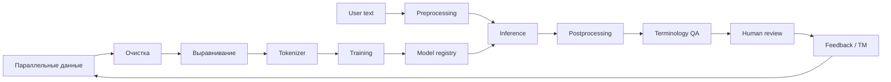
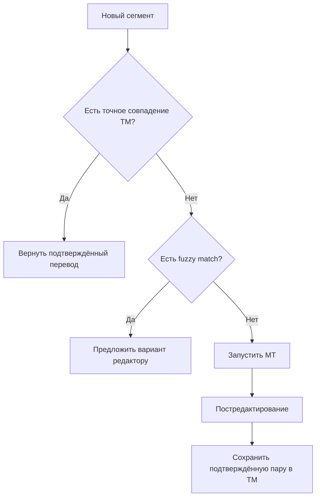

# Раздел 5. Структура систем машинного перевода

> **Дисциплина:** «Основы машинного перевода»  
> **Направление:** 44.03.05 «Педагогическое образование (с двумя профилями подготовки)»  
> **Профиль:** «Информатика и английский язык»  
> **Формат:** лекционный материал для GitHub / Moodle  
> **Актуализация:** август 2026 г.

## Аннотация и цели изучения

Раздел рассматривает систему машинного перевода как инженерный комплекс, а не только как нейросеть. Изучаются сбор и очистка данных, выравнивание параллельных корпусов, обучение токенизатора, обучение модели, декодирование, терминологический контроль, API, мониторинг качества, translation memory и контур Human-in-the-Loop.

После изучения раздела студент должен:

- описывать полный жизненный цикл системы машинного перевода;
- объяснять требования к параллельному корпусу и выравниванию;
- понимать связь tokenizer vocabulary и параметров модели;
- различать модель, декодер, API и workflow;
- проектировать терминологический и human-review контуры;
- учитывать производительность, качество и безопасность образовательных данных.

## Теоретический блок

### 1. Система MT шире, чем модель MT



В производственной системе необходимо версионировать не только веса нейросети, но и:

- данные;
- токенизатор;
- глоссарии;
- параметры декодирования;
- правила пред- и постобработки;
- метрики;
- конфигурацию сервиса.

### 2. Параллельный корпус

Обучающая выборка задаётся набором пар:

$$
D=\{(x^{(i)},y^{(i)})\}_{i=1}^{N}.
$$

Качество корпуса часто важнее его номинального объёма. Типичные дефекты:

- ошибочное выравнивание;
- дубликаты;
- смешение языков;
- OCR-ошибки;
- автоматические переводы низкого качества;
- пропуски сегментов;
- несогласованная терминология.

### 3. Выравнивание предложений

Корректно:

```text
EN1: Machine translation is used in education.
RU1: Машинный перевод используется в образовании.

EN2: It requires critical evaluation.
RU2: Его результаты требуют критической оценки.
```

Если `EN1` ошибочно сопоставить с `RU2`, модель получает ложный обучающий сигнал. При массовом корпусе такие ошибки превращаются в систематический шум.

### 4. Обучение токенизатора

Tokenizer определяет соответствие строк токенам и идентификаторам. Он является частью модели.

```python
from transformers import AutoTokenizer

name = "Helsinki-NLP/opus-mt-en-ru"
tokenizer = AutoTokenizer.from_pretrained(name)

text = "Transformers process token sequences."
encoded = tokenizer(text)

print(encoded["input_ids"])
print(tokenizer.convert_ids_to_tokens(encoded["input_ids"]))
```

Если взять веса одной модели и произвольно заменить её tokenizer vocabulary другим словарём, идентификаторы перестанут соответствовать обученным эмбеддингам.

### 5. Модель выдаёт распределение, а не готовое слово

На шаге $t$ модель формирует logits:

$$
\mathbf{z}_t\in\mathbb{R}^{V},
$$

где $V$ — размер целевого словаря.

После softmax:

$$
P(y_t=i)=
\frac{e^{z_{t,i}}}
{\sum_{j=1}^{V}e^{z_{t,j}}}.
$$

Декодер превращает последовательность распределений в конечный текст.

### 6. Параметры декодирования

На результат могут влиять:

- `num_beams`;
- `length_penalty`;
- `max_new_tokens`;
- обязательные или запрещённые токены;
- стратегия stopping;
- temperature и sampling — преимущественно в генеративных LLM-сценариях.

Для стандартного машинного перевода обычно ценится **воспроизводимость**, поэтому случайность должна быть ограничена.

### 7. Терминологические ограничения

Пусть задано:

`learning management system` → `система управления обучением`.

Контроль термина можно реализовать:

1. до перевода — маркерами или препроцессингом;
2. во время генерации — constrained decoding;
3. после перевода — терминологическим QA;
4. в LLM — через системный промпт и глоссарий.

Ни один способ не устраняет необходимость учитывать контекст.

### 8. Минимальный API-слой

```python
def translate(text, model, tokenizer):
    batch = tokenizer(text, return_tensors="pt")
    output = model.generate(
        **batch,
        num_beams=4,
        max_new_tokens=256,
    )
    return tokenizer.decode(
        output[0],
        skip_special_tokens=True
    )
```

Производственный API дополнительно должен контролировать:

- объём запроса;
- тайм-ауты;
- очереди;
- версию модели;
- аутентификацию;
- безопасное логирование;
- обработку ошибок.

### 9. Translation Memory перед MT



Для повторяющихся учебных инструкций подтверждённая translation memory может быть надёжнее и дешевле повторного вызова генеративной модели.

### 10. Мониторинг системы

| Группа показателей | Пример метрики |
|---|---|
| Качество | chrF, human adequacy score |
| Производительность | latency, requests/s |
| Надёжность | error rate |
| Данные | доля запросов нового домена |
| Терминология | glossary compliance |
| Работа редактора | post-edit distance, время правки |

Постредакторское усилие можно приближённо оценить HTER:

$$
HTER=\frac{E}{|R|},
$$

где $E$ — число минимально необходимых редакторских операций, $|R|$ — длина итогового человеческого варианта.

### 11. Производительность и пакетный инференс

Если требуется перевести $N$ сегментов за время $T$, минимальная средняя пропускная способность:

$$
Throughput=\frac{N}{T}.
$$

Для 1 000 сегментов за 10 минут:

$$
\frac{1000}{600}\approx1.67\ \text{сегмента/с}.
$$

На практике учитываются пиковая нагрузка, длина последовательностей и batch inference.

### 12. Безопасность образовательных данных

При переводе работ студентов, персональных данных, ведомостей, документов практики и внутренней документации необходимо оценивать:

- допустимость передачи содержимого внешнему сервису;
- необходимость обезличивания;
- сроки хранения запросов;
- права доступа;
- договорные и локальные требования организации.

Высокое качество модели не отменяет требований информационной безопасности.

## Современное состояние и российские решения

**PROMT Neural Translation Server** является показательным примером корпоративной серверной архитектуры машинного перевода, где важны централизованное управление, предметная специализация и терминологические ресурсы. В 2026 г. PROMT также сообщил об интеграции LLM в серверные продукты для перевода и постредактирования.  
<https://www.promt.ru/press/news/Konferentsiya_PROMT_AI_Day_proshla_v_SanktPeterburge/>

**Яндекс Переводчик** иллюстрирует централизованный облачный сервис: приложение передаёт текст через пользовательский или программный интерфейс и получает результат, не управляя весами базовой нейросети. Для преподавания это удобный контраст с локальным развертыванием открытой модели.

**GigaChat API** демонстрирует архитектуру универсального LLM-сервиса, где перевод является одним из сценариев диалоговой модели и управляется системной инструкцией.  
<https://developers.sber.ru/docs/ru/gigachat/prompts-hub/content/translation>

**Smartcat** работает на более высоком уровне переводческого workflow: файлы, AI/MT, translation memory, глоссарии, human review и история правок объединяются в одном процессе.  
<https://ru.smartcat.com/ai-translator/>

**ИСП РАН** важен как отечественный источник методов построения систем обработки текста и понимания полного NLP-конвейера — от представления текста до прикладных задач.  
<https://tpc.ispras.ru/>

## Практические кейсы применения в педагогической деятельности

### Кейс 1. Архитектура университетского сервиса EN→RU

Студент проектирует сервис перевода аннотаций учебных материалов. В архитектуре должны присутствовать:

- пользовательский интерфейс;
- API;
- модель;
- терминологический глоссарий;
- журнал качества;
- human approval перед публикацией;
- обезличивание чувствительных данных.

Результат — Mermaid-диаграмма и краткое обоснование каждого компонента.

### Кейс 2. Несовместимый токенизатор

Преподаватель показывает две разные токенизации одной строки. Студенты объясняют, почему веса модели без соответствующего tokenizer vocabulary недостаточны для корректного инференса.

### Кейс 3. Расчёт SLA

Задача: 1 000 сегментов должны быть переведены за 10 минут, при этом средняя задержка одного одиночного запроса — 1,2 с. Студенты оценивают необходимость параллелизма и batch inference.

### Кейс 4. Защита персональных данных

Сценарий: преподаватель хочет отправить публичному переводчику таблицу с ФИО и письменными работами студентов. Группа должна предложить безопасную альтернативу: минимизацию данных, обезличивание или использование разрешённой университетской инфраструктуры.

## Вопросы для самопроверки и дискуссий (5 вопросов)

1. Почему нельзя считать NMT-модель полной системой машинного перевода?
2. Какие ошибки параллельного корпуса особенно опасны для обучения и почему?
3. Как параметры декодирования и beam search влияют на итоговый перевод?
4. Зачем в одной промышленной системе одновременно использовать MT, translation memory и терминологическую базу?
5. Какие требования к информационной безопасности возникают при переводе образовательных данных через внешний облачный сервис?

## Рекомендуемая отечественная литература (до 10 источников)

1. Марчук, Ю. Н. **Компьютерная лингвистика** : учебное пособие / Ю. Н. Марчук. — Москва : АСТ : Восток-Запад, 2007. — 317 с. — ISBN 978-5-17-039480-7.
2. Шипицина, Л. Ю. **Информационные технологии в лингвистике** : учебное пособие / Л. Ю. Шипицина. — 4-е изд. — Москва : ФЛИНТА, 2020. — 128 с. — ISBN 978-5-9765-1431-7.
3. Леонтьева, Н. Н. **Автоматическое понимание текстов: системы, модели, ресурсы** : учебное пособие / Н. Н. Леонтьева. — Москва : Академия, 2006. — 304 с.
4. **Прикладная и компьютерная лингвистика** / под ред. И. С. Николаева, О. В. Митрениной, Т. М. Ландо. — Москва : ЛЕНАНД, 2016. — 320 с.
5. Колин, К. К. Искусственный интеллект в технологиях машинного перевода / К. К. Колин, А. А. Хорошилов, Ю. В. Никитин [и др.] // **Социальные новации и социальные науки**. — 2021. — № 2. — С. 64–80. — DOI 10.31249/snsn/2021.02.05.
6. Камшилова, О. Н. Машинный перевод в эпоху цифровизации: новые практики, процедуры и ресурсы / О. Н. Камшилова, Л. Н. Беляева // **Terra Linguistica**. — 2023. — Т. 14, № 1. — С. 41–56. — DOI 10.18721/JHSS.14105.
7. Овчинникова, И. Г. Использование компьютерных переводческих инструментов: новые возможности, новые ошибки / И. Г. Овчинникова // **Russian Journal of Linguistics**. — 2019. — Т. 23, № 2. — С. 544–561. — DOI 10.22363/2312-9182-2019-23-2-544-561.
