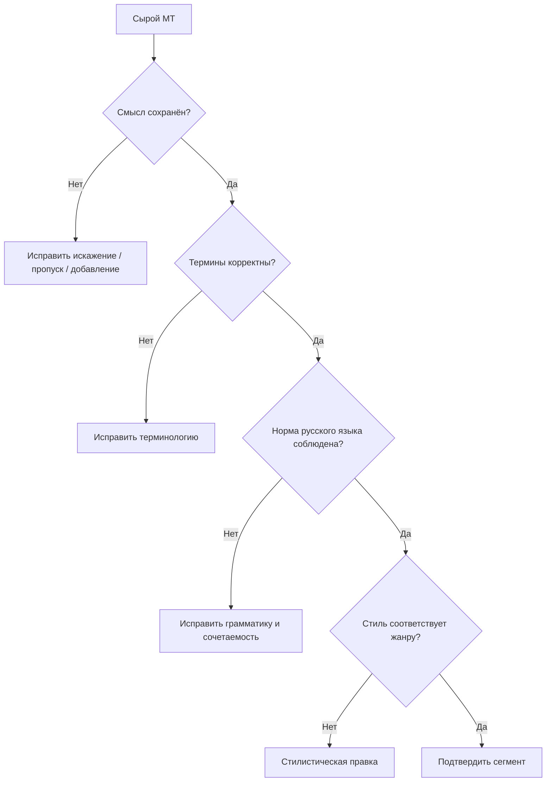

# Раздел 6. Лингвистические проблемы машинного перевода

> **Дисциплина:** «Основы машинного перевода»  
> **Направление:** 44.03.05 «Педагогическое образование (с двумя профилями подготовки)»  
> **Профиль:** «Информатика и английский язык»  
> **Формат:** лекционный материал для GitHub / Moodle  
> **Актуализация:** август 2026 г.

## Аннотация и цели изучения

Раздел завершает курс анализом языковых явлений, которые остаются трудными даже для сильных нейросетевых систем: многозначности, синтаксической неоднозначности, анафоры, эллипсиса, идиоматики, терминологии, безэквивалентной лексики, прагматики, стиля и межъязыковой интерференции. Компьютерная часть связывает ошибки с ограничениями данных, контекста и вероятностного декодирования; переводческая часть — с предпереводческим анализом и MTPE.

После изучения раздела студент должен:

- различать fluency, adequacy, faithfulness и терминологическую согласованность;
- классифицировать лексические, синтаксические, прагматические и стилистические ошибки MT;
- выявлять межъязыковую интерференцию EN→RU;
- выбирать стратегию передачи безэквивалентной лексики и реалий;
- выполнять предредактирование и постредактирование;
- использовать типологию ошибок для педагогической обратной связи.

## Теоретический блок

### 1. Беглость и адекватность — разные свойства

Современная NMT или LLM способна создавать грамматически безупречный русский текст, содержащий смысловую ошибку. Поэтому качество следует разделять на несколько измерений:

- **fluency** — естественность текста на целевом языке;
- **adequacy** — сохранение содержания исходника;
- **faithfulness** — отсутствие необоснованных добавлений и пропусков;
- **terminological consistency** — единообразие терминологии;
- **style/register** — соответствие жанру, ситуации и адресату.

Для научного и образовательного текста адекватность и точность обычно имеют приоритет над стилистической «красотой».

### 2. Лексическая многозначность

**EN:** `The students used a Python shell.`

Слово `shell` может означать оболочку, раковину, скорлупу, гильзу. В информатическом контексте требуется `оболочка`, а в более точном контексте — `командная оболочка` или `интерактивная оболочка`.

Задача выбора значения называется **word sense disambiguation (WSD)**. Нейронная модель решает её не через явную словарную помету, а через распределённое контекстное представление.

### 3. Синтаксическая неоднозначность

**EN:** `I saw the student with the telescope.`

Возможны как минимум две интерпретации:

1. говорящий использовал телескоп;
2. у студента был телескоп.

Если более широкий контекст отсутствует, переводчик не должен необоснованно «угадывать» смысл. Для системы МП это принципиальная проблема: модель часто выбирает наиболее вероятную интерпретацию и делает неоднозначность невидимой для читателя.

### 4. Анафора и референция

**EN:** `The teacher spoke to the student after she finished the test.`

При переводе на русский язык местоимение `she` может потребовать выбора грамматического рода и конкретного референта. Ошибка в кореференции меняет фактическое содержание.

Связь с Transformer состоит в том, что контекст доступен через многоуровневые представления и attention, однако attention не является формальным логическим механизмом разрешения референции.

### 5. Эллипсис

**EN:** `John chose Python, and Mary Java.`  
**RU:** `Джон выбрал Python, а Мэри — Java.`

Во второй части глагол отсутствует на поверхности, но восстанавливается из структуры первой части. Машинная система должна либо сохранить естественный русский эллипсис, либо грамматически корректно эксплицировать пропущенный компонент.

### 6. Идиоматика и фразеология

**EN:** `This bug is a pain in the neck.`

Буквальный вариант `эта ошибка — боль в шее` в обычном техническом контексте не передаёт функцию выражения. Более естественно:

- `с этой ошибкой одни мучения`;
- `эта ошибка доставляет массу проблем`.

Фразеологический перевод требует учитывать коммуникативную функцию и регистр, а не только значения отдельных слов.

### 7. Безэквивалентная лексика и образовательные реалии

Примеры:

- `GCSE`;
- `A-levels`;
- `sixth form`;
- `freshman`;
- `county`.

Возможные стратегии:

1. транслитерация;
2. описательный перевод;
3. функциональный аналог;
4. сохранение оригинального наименования с пояснением.

В образовательном тексте особенно опасна необоснованная **доместикация**, когда британская или американская институция заменяется российской как будто это один и тот же объект.

### 8. Терминологическая неоднозначность

Слова `model`, `training`, `attention`, `token` меняют значение в зависимости от домена.

В машинном обучении:

- `model` → `модель`;
- `training` → `обучение`;
- `attention` → `внимание` / `механизм внимания`;
- `token` → `токен`.

Однако `training` в образовательной методике может означать `тренинг`, `подготовку` или `обучение`, а `attention` в общей лексике — обычное `внимание`. Поэтому glossary compliance должен быть **контекстно и предметно обусловленным**.

### 9. Межъязыковая интерференция EN→RU

| Калькированная или неудачная конструкция | Предпочтительный вариант |
|---|---|
| `делать решение` | `принимать решение` |
| `является важным отметить` | `важно отметить` |
| `в терминах обучения` | `с точки зрения обучения` / по контексту |
| `выполнять исследование` | `проводить исследование` |
| `адресовать проблему` | `рассмотреть проблему`, `решать проблему` |
| `имплементировать метод` | `реализовать метод` |

Нейронный перевод может воспроизводить кальки, если они статистически представлены в обучающих данных. Поэтому высокая частотность конструкции не гарантирует её стилистической нормативности.

### 10. «Ложные друзья переводчика»

- `accurate` → `точный`, а не автоматически `аккуратный`;
- `actual` → `фактический`, `реальный`, иногда `текущий`, но не всегда `актуальный`;
- `intelligent system` → `интеллектуальная система`;
- `academic` → `академический`, `научный` или `учебный` — по контексту;
- `eventually` → `в конечном счёте`, а не `эвентуально`.

Такие единицы удобны для диагностических заданий, потому что ошибка выглядит внешне правдоподобно.

### 11. Предредактирование

До запуска MT можно уменьшить неоднозначность исходника.

Неудачно:

`After reviewing it, the teacher changed it.`

Лучше:

`After reviewing the student's translation, the teacher changed the assessment rubric.`

Предредактирование особенно эффективно для технических инструкций, учебных заданий и шаблонных документов.

### 12. Постредактирование как последовательная диагностика

Такой порядок важен: нет смысла полировать стиль предложения, смысл которого передан неверно.

### 13. TER и редакторское расстояние

Translation Edit Rate оценивает число операций, необходимых для преобразования гипотезы в референс:

$$
TER=\frac{S+D+I+Shifts}{N},
$$

где:

- $S$ — замены;
- $D$ — удаления;
- $I$ — вставки;
- $Shifts$ — перестановки фрагментов;
- $N$ — число единиц в референсе.

TER помогает измерять объём редактирования, но не отражает когнитивную трудность каждой правки.

### 14. Ошибка «правдоподобного перевода»

Особенно опасен результат, который:

- грамматически безупречен;
- стилистически гладок;
- но меняет факт или логическое отношение.

Проверять следует прежде всего:

1. отрицания;
2. числа и единицы измерения;
3. имена и названия;
4. модальность (`may`, `must`, `should`);
5. причинно-следственные связи;
6. терминологию;
7. пропуски и добавления.

Например:

**EN:** `Students may use a dictionary.`

`Студенты могут пользоваться словарём` — разрешение.

`Студенты должны пользоваться словарём` — уже другое педагогическое требование.

### 15. Связь лингвистической ошибки с вычислительным конвейером

Важно избегать упрощения «нейросеть не знает правило». Ошибка может быть обусловлена данными, сегментацией, контекстом, доменным сдвигом, способом декодирования или неоднозначностью самого источника.

## Современное состояние и российские решения

Современные российские исследования показывают, что с ростом беглости NMT и LLM меняется структура ошибок: грубые нарушения грамматики встречаются реже, но сохраняются проблемы широкого контекста, терминологии, семантической точности и стилистической адекватности.

Е. Ю. Фатюшина и О. Ю. Семина на материале технического перевода рассматривают ограничения современных систем и необходимость пред-, интер- и постредактирования. Для учебного курса эта работа важна тем, что связывает качество MT с широким контекстом и экстралингвистическим знанием.

А. А. Хромова и Р. Р. Лукманова анализируют постредактирование англо-русского научного машинного перевода и систематизируют типичные синтаксические и терминологические проблемы.

**Яндекс** при обновлениях 2024–2025 гг. отдельно подчёркивал работу с длинным контекстом, фразеологией и профессиональной лексикой. Сам выбор этих направлений показывает, что развитие MT всё больше связано не с отдельной словоформой, а с дискурсивным контекстом.  
<https://yandex.ru/company/news/02-07-06-2024>  
<https://yandex.ru/company/news/22-12-2025-02>

**PROMT** сохраняет практический акцент на тематических решениях и корпоративной терминологии, а **Smartcat** — на соединении AI-перевода с глоссариями, translation memory и экспертной проверкой.

Для педагогической практики продуктивнее не противопоставлять «человека» и «машину», а формировать у студента **компетенцию диагностики ошибки**: назвать языковую причину, оценить серьёзность и выполнить минимальное обоснованное исправление.

## Практические кейсы применения в педагогической деятельности

### Кейс 1. Error taxonomy

Студенты получают 20 фрагментов машинного перевода и размечают ошибки:

- `LEX` — лексика;
- `WSD` — неверный выбор значения;
- `TERM` — терминология;
- `AGR` — согласование;
- `REF` — референция;
- `PRAG` — прагматика;
- `STYLE` — стиль;
- `OMIT` — пропуск;
- `ADD` — необоснованное добавление.

После разметки класс строит распределение ошибок и сравнивает системы.

### Кейс 2. Диагностика интерференции

Студент сравнивает:

1. английский оригинал;
2. сырой машинный перевод;
3. отредактированный русский вариант.

Требуется найти конструкции, которые грамматически допустимы, но стилистически выдают калькирование с английского.

### Кейс 3. Модальность учебной инструкции

**EN:** `Students are expected to submit the assignment by Friday.`

Варианты:

- `Ожидается, что студенты представят задание к пятнице.`
- `Студенты должны сдать задание до пятницы.`

Студенты обсуждают, как второй перевод усиливает нормативность высказывания и может изменить педагогическую коммуникацию.

### Кейс 4. Безэквивалентная образовательная лексика

Группа переводит текст о британской школе, содержащий `GCSE`, `A-levels`, `sixth form`. Требуется сохранить реалии и подготовить краткие пояснения, не подменяя их российскими институциями.

## Вопросы для самопроверки и дискуссий

1. Почему грамматически беглый машинный перевод может быть семантически неверным?
2. Какие виды неоднозначности особенно опасны при переводе EN→RU?
3. Чем исправление терминологической ошибки отличается от стилистического постредактирования?
4. Как межъязыковая интерференция проявляется в машинном переводе на русский язык?
5. Почему в образовательных и научных текстах особенно важно проверять модальность, отрицание, числа и причинно-следственные связи?

## Рекомендуемая отечественная литература

1. Баранов, А. Н. **Введение в прикладную лингвистику** / А. Н. Баранов. — 5-е изд. — Москва : URSS, 2017. — 367 с. — ISBN 978-5-9710-4237-2.
2. Марчук, Ю. Н. **Модели перевода** : учебное пособие / Ю. Н. Марчук. — Москва : Академия, 2010. — 176 с. — ISBN 978-5-7695-6991-3.
3. Раренко, М. Б. Машинный перевод как вызов / М. Б. Раренко // **Вестник Московского университета. Серия 22. Теория перевода**. — 2021. — № 2. — С. 117–126.
4. Овчинникова, И. Г. Использование компьютерных переводческих инструментов: новые возможности, новые ошибки / И. Г. Овчинникова // **Russian Journal of Linguistics**. — 2019. — Т. 23, № 2. — С. 544–561. — DOI 10.22363/2312-9182-2019-23-2-544-561.
5. Нечаева, Н. В. Постредактирование машинного перевода как актуальное направление подготовки переводчиков в вузах / Н. В. Нечаева, С. Ю. Светова // **Вопросы методики преподавания в вузе**. — 2018. — Т. 7, № 25. — С. 64–72. — DOI 10.18720/HUM/ISSN2227-8591.25.07.
6. Хромова, А. А. Постредактирование англо-русского машинного перевода: проблемы, методы и оптимизация / А. А. Хромова, Р. Р. Лукманова // **Филологические науки. Вопросы теории и практики**. — 2024. — Т. 17, № 3. — С. 948–956. — DOI 10.30853/phil20240138.
7. Фатюшина, Е. Ю. Машинный перевод технического текста: современное состояние и перспективы / Е. Ю. Фатюшина, О. Ю. Семина // **Актуальные вопросы современной филологии и журналистики**. — 2024. — № 3 (54). — С. 38–47. — DOI 10.36622/2587-9510.2024.54.3.004.
