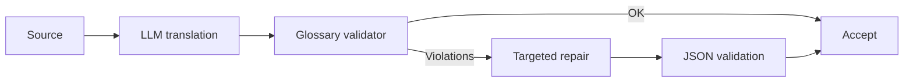

# Лабораторный практикум по дисциплине «Основы машинного перевода»

## Лабораторная работа 3. «Контекстный перевод и локализация с помощью LLM (GigaChat / YandexGPT API / OpenSource LLM)»

**Раздел курса:** 5  
**Максимум:** 20 баллов  
**Сквозной кейс:** перевод того же учебного модуля с учетом глобального контекста, терминологии, стиля, разметки и педагогической функции текста.

### Цель и формируемые компетенции (ОПК-2, ОПК-9, УК-1, УК-6)

**Цель** — построить управляемый LLM-пайплайн локализации, в котором перевод задается системной инструкцией, few-shot примерами, терминологическими ограничениями и формальной JSON-схемой.

- **ОПК-2:** применение генеративного ИИ для локализации образовательного контента;
- **ОПК-9:** использование API и локальных LLM в цифровом образовательном workflow;
- **УК-1:** критическая проверка контекстных, стилистических и терминологических решений модели;
- **УК-6:** документирование промптов, параметров, версий и повторяемости эксперимента.

### Входные данные и подготовительные требования

Используйте:

```text
data/source_en.md
data/glossary.csv
data/memory.tmx
lab02/results_marian.jsonl
lab02/results_nllb.jsonl
```

Выберите **один основной вариант**:

1. GigaChat API;
2. YandexGPT API;
3. open-source instruct-модель, запускаемая локально.

Вторую LLM можно использовать дополнительно для сравнения.

#### Безопасность ключей

`.env`:

```text
GIGACHAT_CREDENTIALS=...
YANDEX_FOLDER_ID=...
YANDEX_API_KEY=...
```

`.gitignore`:

```gitignore
.env
.venv/
__pycache__/
*.pyc
```

Никогда не добавляйте реальные ключи в Git.

Базовые зависимости:

```bash
pip install python-dotenv pydantic pandas
```

Для GigaChat:

```bash
pip install gigachat
```

Для локального варианта:

```bash
pip install transformers accelerate torch
```

Официальные материалы:

- GigaChat, перевод: <https://developers.sber.ru/docs/ru/gigachat/prompts-hub/content/translation>
- GigaChat, structured output: <https://developers.sber.ru/docs/ru/gigachat/guides/structured-output>
- Yandex AI Studio: <https://yandex.cloud/ru/docs/ai-studio/>
- YandexGPT structured output/API: <https://yandex.cloud/en/docs/foundation-models/text-generation/api-ref/grpc/Tokenizer/tokenizeCompletion>

### Пошаговое руководство к выполнению (с примерами кода на Python 3.10+ и инструкциями для Smartcat/API)

#### Шаг 1. Подготовка глоссария как контекста

```python
import pandas as pd

glossary = pd.read_csv("data/glossary.csv")

term_lines = [
    f"- {row.en} = {row.ru}"
    for row in glossary.itertuples(index=False)
]

glossary_block = "\n".join(term_lines)
print(glossary_block)
```

#### Шаг 2. Системный промпт

`lab03/prompt_system.txt`:

```text
Ты — профессиональный локализатор учебных материалов по информатике.

Задача:
переводить с английского языка на русский язык для студентов педагогического вуза.

Правила:
1. Сохраняй смысл, модальность и логические связи.
2. Соблюдай утвержденный глоссарий.
3. Не переводи Python-код, имена функций, ключевые слова и пути к файлам.
4. Сохраняй Markdown и LaTeX.
5. Не добавляй факты, которых нет в исходнике.
6. Инструкции студенту формулируй ясно, нейтрально и академично.
7. Если термин неоднозначен, выбирай значение из предметной области информатики.
8. Возвращай только данные по заданной JSON-схеме.
```

#### Шаг 3. Few-shot Translation

`lab03/fewshot.json`:

```json
[
  {
    "source": "A variable stores a value.",
    "translation": "Переменная хранит значение.",
    "note": "variable = переменная"
  },
  {
    "source": "Run the code and compare the result.",
    "translation": "Запустите код и сравните результат.",
    "note": "Instructional imperative adapted to Russian academic style"
  }
]
```

Few-shot примеры должны показывать **тип переводческого решения**, а не только словарные пары.

#### Шаг 4. JSON-схема

Ожидаемый ответ:

```json
{
  "segment_id": "s001",
  "translation": "Переменная хранит значение.",
  "used_terms": [
    {
      "source": "variable",
      "target": "переменная"
    }
  ],
  "warnings": []
}
```

Pydantic:

```python
from pydantic import BaseModel, Field

class UsedTerm(BaseModel):
    source: str
    target: str

class TranslationResult(BaseModel):
    segment_id: str
    translation: str
    used_terms: list[UsedTerm] = Field(default_factory=list)
    warnings: list[str] = Field(default_factory=list)
```

#### Шаг 5. GigaChat с `json_schema`

Актуальная документация GigaChat позволяет задавать `response_format` со схемой и `strict=True`.

```python
import os
from dotenv import load_dotenv
from gigachat import GigaChat
from gigachat.models import Chat, Messages, MessagesRole

load_dotenv()

SCHEMA = {
    "type": "object",
    "properties": {
        "segment_id": {"type": "string"},
        "translation": {"type": "string"},
        "used_terms": {
            "type": "array",
            "items": {
                "type": "object",
                "properties": {
                    "source": {"type": "string"},
                    "target": {"type": "string"}
                },
                "required": ["source", "target"]
            }
        },
        "warnings": {
            "type": "array",
            "items": {"type": "string"}
        }
    },
    "required": [
        "segment_id",
        "translation",
        "used_terms",
        "warnings"
    ],
    "additionalProperties": False
}

system_prompt = open(
    "lab03/prompt_system.txt",
    encoding="utf-8"
).read()

user_payload = f"""
segment_id: s001

Глоссарий:
{glossary_block}

Исходный текст:
A function returns a value.
"""

chat = Chat(
    messages=[
        Messages(
            role=MessagesRole.SYSTEM,
            content=system_prompt
        ),
        Messages(
            role=MessagesRole.USER,
            content=user_payload
        )
    ],
    response_format={
        "type": "json_schema",
        "schema": SCHEMA,
        "strict": True
    }
)

with GigaChat(
    credentials=os.environ["GIGACHAT_CREDENTIALS"]
) as client:
    response = client.chat(chat)

raw_answer = response.choices[0].message.content
print(raw_answer)
```

> Зафиксируйте версию SDK. Если сигнатура отличается, адаптируйте код по актуальной документации, а не скрывайте различие.

#### Шаг 6. YandexGPT

Yandex AI Studio поддерживает structured output в виде JSON object или JSON Schema. Общая структура сообщений:

```python
messages = [
    {
        "role": "system",
        "text": system_prompt,
    },
    {
        "role": "user",
        "text": user_payload,
    },
]
```

Концептуальная конфигурация актуального SDK:

```python
# Точные import-имена зависят от версии Yandex AI Studio SDK.
# В отчете обязательна ссылка на использованную страницу документации.

model = sdk.chat.completions("yandexgpt").configure(
    temperature=0.1,
    max_tokens=800,
    response_format=SCHEMA,
)

result = model.run(messages)
```

Требуется реальный API-вызов. Подмена вызова заранее записанным JSON не засчитывается.

#### Шаг 7. Open-source LLM

Если облачный API недоступен, допускается локальная instruct-модель:

```python
from transformers import pipeline

generator = pipeline(
    "text-generation",
    model="<instruction-model>",
    device_map="auto"
)

prompt = f"""
{system_prompt}

Глоссарий:
{glossary_block}

Исходный сегмент:
A loop repeats a block of instructions.

Верни JSON.
"""

out = generator(
    prompt,
    max_new_tokens=300,
    do_sample=False
)

print(out[0]["generated_text"])
```

В отчете укажите точный model id, лицензию, размер, аппаратную среду и способ обеспечения структурированного ответа.

#### Шаг 8. Три режима промптинга

На одних и тех же 12+ сегментах:

1. **Zero-shot** — короткая инструкция «переведи»;
2. **Controlled** — системный промпт + glossary;
3. **Few-shot** — системный промпт + glossary + 2–4 примера.

Храните результаты JSONL:

```json
{"id":"s001","mode":"zero","translation":"..."}
{"id":"s001","mode":"controlled","translation":"..."}
{"id":"s001","mode":"fewshot","translation":"..."}
```

#### Шаг 9. Управление стилем

Сравните:

```text
Style A:
академический нейтральный стиль для учебного пособия вуза.
```

и

```text
Style B:
дружелюбная инструкция преподавателя для первокурсника,
без разговорного сленга.
```

Проведите сравнение минимум на трех сегментах.

#### Шаг 10. Валидация JSON

```python
import json
from pydantic import ValidationError

def validate_response(raw: str):
    data = json.loads(raw)
    return TranslationResult.model_validate(data)

try:
    parsed = validate_response(raw_answer)
    print(parsed)
except (json.JSONDecodeError, ValidationError) as exc:
    print("Invalid structured output:", exc)
```

#### Шаг 11. Поиск терминологических нарушений

```python
def find_term_violations(source, target, glossary):
    errors = []

    for row in glossary.itertuples(index=False):
        src_term = str(row.en)
        tgt_term = str(row.ru)

        if src_term.lower() in source.lower():
            if tgt_term.lower() not in target.lower():
                errors.append({
                    "source_term": src_term,
                    "expected": tgt_term,
                })

    return errors
```

Не заменяйте термины простым `str.replace()` без контекста.

#### Шаг 12. Repair-pass

Если найдено нарушение, отправьте узкую инструкцию:

```text
Исправь только терминологические несоответствия из списка.
Не переписывай остальные части перевода.
Не меняй код, Markdown и факты.
Верни исправленный перевод и перечень изменений.
```



#### Шаг 13. Трассировка

В `results_llm.jsonl` сохраняйте:

- `segment_id`;
- `model`;
- `model_version`, если возвращается;
- `mode`;
- `temperature`;
- `prompt_version`;
- `translation`;
- `warnings`;
- `term_violations_before`;
- `term_violations_after`.

Не сохраняйте secrets.

### Задания для самостоятельного выполнения (3-4 варианта)

#### Вариант 1. Variables and Data Types
Проверьте `value`, `object`, `string`, `assignment`.

#### Вариант 2. Conditional Statements
Проверьте `branch`, `condition`, `statement`, `else clause`; сравните академический и инструктивный стиль.

#### Вариант 3. Loops and Iteration
Проверьте сохранность `for`, `while`, `break`, `continue`, `range()`.

#### Вариант 4. Functions and Parameters
Проверьте `function`, `argument`, `parameter`, `return value`, `scope`; отдельно различие `argument` / `parameter`.

Для каждого варианта:

1. 12+ сегментов;
2. zero-shot, controlled, few-shot;
3. JSON validation;
4. glossary validation;
5. 3+ стилистических сравнения;
6. 5+ найденных проблем;
7. repair-pass минимум для 3 сегментов.

### Требования к оформлению отчета в GitHub-репозитории

```text
lab03/
├── translate_llm.py
├── prompt_system.txt
├── fewshot.json
├── results_llm.jsonl
├── prompt_versions.md
└── report.md
```

`report.md`:

1. выбранная модель/API;
2. точный model id/version;
3. схема авторизации без ключа;
4. системный промпт;
5. JSON Schema;
6. таблица zero/controlled/few-shot;
7. анализ 5+ ошибок;
8. terminology repair;
9. сравнение стилей;
10. ограничения и вывод.

### Детализированный критериальный лист оценки (Рубрикатор на 20 баллов):

| Критерий | Состав критерия | Баллы |
|---|---|---:|
| **Работоспособность пайплайна/кода** | Реальный API/локальный LLM — 2; три режима — 2; JSON validation + repair — 2 | **6** |
| **Корректность лингвистической обработки и валидации** | Glossary compliance — 2; Markdown/код/модальность — 2; валидный JSON — 1 | **5** |
| **Анализ ошибок и аргументация решений** | 5+ ошибок — 2; zero/few-shot и стиль — 2; вывод — 1 | **5** |
| **Оформление репозитория, reproducibility** | Версии prompt/model — 1; README — 1; зависимости — 1; отсутствие секретов — 1 | **4** |
| **Итого** |  | **20** |
