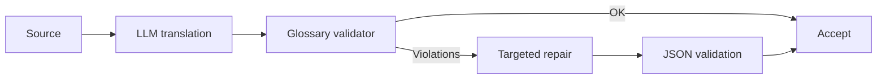

# Лабораторный практикум по дисциплине «Основы машинного перевода»

## Лабораторная работа 3. «Контекстный перевод и локализация с помощью LLM (GigaChat / Yandex AI Studio / локальная LLM)»

**Раздел курса:** 5  
**Максимум:** 20 баллов  
**Сквозной кейс:** перевод того же учебного модуля с учетом глобального контекста, терминологии, стиля, разметки и педагогической функции текста.

### Цель и формируемые компетенции (ОПК-2, ОПК-9, УК-1, УК-6)

**Цель** — построить управляемый LLM-пайплайн локализации, в котором перевод задается системной инструкцией, few-shot примерами, терминологическими ограничениями и формальной JSON-схемой.

- **ОПК-2:** применение генеративного ИИ для локализации образовательного контента;
- **ОПК-9:** использование API и локальных LLM в цифровом образовательном workflow;
- **УК-1:** критическая проверка контекстных, стилистических и терминологических решений модели;
- **УК-6:** документирование промптов, параметров, версий и повторяемости эксперимента.

### Задачи лабораторной работы

В ходе работы необходимо:

1. подготовить воспроизводимый LLM-пайплайн перевода EN→RU;
2. сформировать системный промпт и зафиксировать его версию;
3. подключить утвержденный глоссарий из ЛР № 1 как терминологическое ограничение;
4. определить JSON Schema и валидировать структурированный ответ;
5. сравнить **zero-shot**, **controlled** и **few-shot** режимы на одинаковых сегментах;
6. проверить сохранение Markdown, inline-code, программных обозначений и модальности;
7. выполнить автоматическую терминологическую QA и ручную проверку срабатываний;
8. реализовать targeted repair-pass для найденных нарушений;
9. сравнить академический и инструктивный стили;
10. зафиксировать model id, параметры генерации, prompt version и ограничения эксперимента.

### Инструменты

| Инструмент | Назначение |
|---|---|
| **Python 3.10+** | реализация и автоматизация пайплайна |
| **JupyterLab / Google Colab** | воспроизводимый эксперимент и отчет с кодом |
| **pandas** | работа с сегментами, glossary и результатами |
| **Pydantic** | проверка структурированного JSON-ответа |
| **python-dotenv** | безопасная загрузка параметров окружения |
| **GigaChat API** | облачный LLM-вариант с structured output |
| **Yandex AI Studio** | облачный LLM-вариант и JSON/JSON Schema output |
| **Ollama** | локальный запуск instruct-моделей и structured output |
| **Git / GitHub** | версионирование prompts, кода и результатов |
| **Glossary/TMX из ЛР № 1** | терминологический и переводческий контекст |
| **Результаты ЛР № 2** | дополнительная база для сравнения NMT и LLM |

Студент выбирает **один основной LLM-инструмент**: GigaChat, Yandex AI Studio или локальную instruct-модель. Вторая модель может использоваться дополнительно.

### Входные данные и подготовительные требования

Используйте результаты предыдущих лабораторных работ:

```text
data/source_en.md
data/glossary.csv
data/memory.tmx
data/reference_ru.md
lab02/results/results_marian.jsonl
lab02/results/results_nllb.jsonl
```

В ЛР № 3 студент продолжает **тот же индивидуальный вариант**, который выполнял в ЛР № 1 и ЛР № 2.

| Вариант | Тема учебного модуля |
|---:|---|
| 1 | Variables and Data Types |
| 2 | Conditional Statements |
| 3 | Loops and Iteration |
| 4 | Functions and Parameters |
| 5 | Lists, Tuples and Sequence Operations |
| 6 | Dictionaries and Sets |
| 7 | File Input and Output |
| 8 | Classes and Objects |
| 9 | Exceptions and Error Handling |
| 10 | Modules, Packages and Imports |

**Вариант 11 — Algorithms and Computational Complexity** является полностью решенным демонстрационным вариантом преподавателя и студентам как индивидуальное задание не назначается.

Если результаты ЛР № 2 отсутствуют, основная часть ЛР № 3 все равно выполняется по `source_en.md`, `glossary.csv`, `memory.tmx` и `reference_ru.md`; NMT-результаты используются как дополнительная точка сравнения.

#### Безопасность ключей

`.env`:

```text
GIGACHAT_CREDENTIALS=...
YANDEX_FOLDER_ID=...
YANDEX_API_KEY=...
```

`.gitignore`:

```gitignore
.env
.venv/
__pycache__/
*.pyc
```

Никогда не добавляйте реальные ключи в Git.

Базовые зависимости:

```bash
pip install python-dotenv pydantic pandas
```

Для GigaChat:

```bash
pip install gigachat
```

Для локального варианта через Ollama:

```bash
pip install ollama
```

Для прямого запуска модели через Hugging Face Transformers:

```bash
pip install transformers accelerate torch
```

Официальные материалы:

- GigaChat, перевод: <https://developers.sber.ru/docs/ru/gigachat/prompts-hub/content/translation>
- GigaChat, structured output: <https://developers.sber.ru/docs/ru/gigachat/guides/structured-output>
- Yandex AI Studio: <https://yandex.cloud/ru/docs/ai-studio/>
- Yandex Cloud, structured output для Foundation Models: <https://yandex.cloud/en/docs/serverless-integrations/concepts/workflows/yawl/integration/foundationmodelscall>
- Ollama, structured outputs: <https://ollama.com/blog/structured-outputs>

### Пошаговое руководство к выполнению (с примерами кода на Python 3.10+ и инструкциями для Smartcat/API)

#### Шаг 1. Подготовка глоссария как контекста

```python
import pandas as pd

glossary = pd.read_csv("data/glossary.csv")

term_lines = [
    f"- {row.en} = {row.ru}"
    for row in glossary.itertuples(index=False)
]

glossary_block = "\n".join(term_lines)
print(glossary_block)
```

#### Шаг 2. Системный промпт

`lab03/prompt_system.txt`:

```text
Ты — профессиональный локализатор учебных материалов по информатике.

Задача:
переводить с английского языка на русский язык для студентов педагогического вуза.

Правила:
1. Сохраняй смысл, модальность и логические связи.
2. Соблюдай утвержденный глоссарий.
3. Не переводи Python-код, имена функций, ключевые слова и пути к файлам.
4. Сохраняй Markdown и LaTeX.
5. Не добавляй факты, которых нет в исходнике.
6. Инструкции студенту формулируй ясно, нейтрально и академично.
7. Если термин неоднозначен, выбирай значение из предметной области информатики.
8. Возвращай только данные по заданной JSON-схеме.
```

#### Шаг 3. Few-shot Translation

`lab03/fewshot.json`:

```json
[
  {
    "source": "A variable stores a value.",
    "translation": "Переменная хранит значение.",
    "note": "variable = переменная"
  },
  {
    "source": "Run the code and compare the result.",
    "translation": "Запустите код и сравните результат.",
    "note": "Instructional imperative adapted to Russian academic style"
  }
]
```

Few-shot примеры должны показывать **тип переводческого решения**, а не только словарные пары.

#### Шаг 4. JSON-схема

Ожидаемый ответ:

```json
{
  "segment_id": "s001",
  "translation": "Переменная хранит значение.",
  "used_terms": [
    {
      "source": "variable",
      "target": "переменная"
    }
  ],
  "warnings": []
}
```

Pydantic:

```python
from pydantic import BaseModel, Field

class UsedTerm(BaseModel):
    source: str
    target: str

class TranslationResult(BaseModel):
    segment_id: str
    translation: str
    used_terms: list[UsedTerm] = Field(default_factory=list)
    warnings: list[str] = Field(default_factory=list)
```

#### Шаг 5. GigaChat с `json_schema`

Актуальная документация GigaChat позволяет задавать `response_format` со схемой и `strict=True`.

```python
import os
from dotenv import load_dotenv
from gigachat import GigaChat
from gigachat.models import Chat, Messages, MessagesRole

load_dotenv()

SCHEMA = {
    "type": "object",
    "properties": {
        "segment_id": {"type": "string"},
        "translation": {"type": "string"},
        "used_terms": {
            "type": "array",
            "items": {
                "type": "object",
                "properties": {
                    "source": {"type": "string"},
                    "target": {"type": "string"}
                },
                "required": ["source", "target"]
            }
        },
        "warnings": {
            "type": "array",
            "items": {"type": "string"}
        }
    },
    "required": [
        "segment_id",
        "translation",
        "used_terms",
        "warnings"
    ],
    "additionalProperties": False
}

system_prompt = open(
    "lab03/prompt_system.txt",
    encoding="utf-8"
).read()

user_payload = f"""
segment_id: s001

Глоссарий:
{glossary_block}

Исходный текст:
A function returns a value.
"""

chat = Chat(
    messages=[
        Messages(
            role=MessagesRole.SYSTEM,
            content=system_prompt
        ),
        Messages(
            role=MessagesRole.USER,
            content=user_payload
        )
    ],
    response_format={
        "type": "json_schema",
        "schema": SCHEMA,
        "strict": True
    }
)

with GigaChat(
    credentials=os.environ["GIGACHAT_CREDENTIALS"]
) as client:
    response = client.chat(chat)

raw_answer = response.choices[0].message.content
print(raw_answer)
```

> Зафиксируйте версию SDK. Если сигнатура отличается, адаптируйте код по актуальной документации, а не скрывайте различие.

#### Шаг 6. YandexGPT

Yandex AI Studio поддерживает structured output в виде JSON object или JSON Schema. Общая структура сообщений:

```python
messages = [
    {
        "role": "system",
        "text": system_prompt,
    },
    {
        "role": "user",
        "text": user_payload,
    },
]
```

Концептуальная конфигурация актуального SDK:

```python
# Точные import-имена зависят от версии Yandex AI Studio SDK.
# В отчете обязательна ссылка на использованную страницу документации.

model = sdk.chat.completions("yandexgpt").configure(
    temperature=0.1,
    max_tokens=800,
    response_format=SCHEMA,
)

result = model.run(messages)
```

Требуется реальный API-вызов. Подмена вызова заранее записанным JSON не засчитывается.

#### Шаг 7. Локальная LLM через Ollama

Для воспроизводимого локального варианта рекомендуется Ollama. Он позволяет запускать instruct-модели локально и передавать JSON Schema как формат ответа.

Установка модели, например:

```bash
ollama pull qwen2.5:7b
pip install ollama
```

Пример:

```python
from ollama import chat

response = chat(
    model="qwen2.5:7b",
    messages=[
        {
            "role": "system",
            "content": system_prompt,
        },
        {
            "role": "user",
            "content": user_payload,
        },
    ],
    format=SCHEMA,
    options={
        "temperature": 0
    },
)

raw_answer = response.message.content
print(raw_answer)
```

В отчете обязательно укажите:

- точный model id;
- размер/вариант модели;
- способ запуска;
- CPU/GPU;
- объем RAM/VRAM;
- параметры генерации.

Если Ollama использовать невозможно, допускается прямой запуск open-source instruct-модели через Hugging Face Transformers. В этом случае студент самостоятельно обеспечивает устойчивый JSON-вывод и документирует выбранный способ.

#### Шаг 8. Три режима промптинга

На одних и тех же 12+ сегментах:

1. **Zero-shot** — короткая инструкция «переведи»;
2. **Controlled** — системный промпт + glossary;
3. **Few-shot** — системный промпт + glossary + 2–4 примера.

Храните результаты JSONL:

```json
{"id":"s001","mode":"zero","translation":"..."}
{"id":"s001","mode":"controlled","translation":"..."}
{"id":"s001","mode":"fewshot","translation":"..."}
```

#### Шаг 9. Управление стилем

Сравните:

```text
Style A:
академический нейтральный стиль для учебного пособия вуза.
```

и

```text
Style B:
дружелюбная инструкция преподавателя для первокурсника,
без разговорного сленга.
```

Проведите сравнение минимум на трех сегментах.

#### Шаг 10. Валидация JSON

```python
import json
from pydantic import ValidationError

def validate_response(raw: str):
    data = json.loads(raw)
    return TranslationResult.model_validate(data)

try:
    parsed = validate_response(raw_answer)
    print(parsed)
except (json.JSONDecodeError, ValidationError) as exc:
    print("Invalid structured output:", exc)
```

#### Шаг 11. Поиск терминологических нарушений

```python
def find_term_violations(source, target, glossary):
    errors = []

    for row in glossary.itertuples(index=False):
        src_term = str(row.en)
        tgt_term = str(row.ru)

        if src_term.lower() in source.lower():
            if tgt_term.lower() not in target.lower():
                errors.append({
                    "source_term": src_term,
                    "expected": tgt_term,
                })

    return errors
```

Не заменяйте термины простым `str.replace()` без контекста.

#### Шаг 12. Repair-pass

Если найдено нарушение, отправьте узкую инструкцию:

```text
Исправь только терминологические несоответствия из списка.
Не переписывай остальные части перевода.
Не меняй код, Markdown и факты.
Верни исправленный перевод и перечень изменений.
```



#### Шаг 13. Трассировка

В `results_llm.jsonl` сохраняйте:

- `segment_id`;
- `model`;
- `model_version`, если возвращается;
- `mode`;
- `temperature`;
- `prompt_version`;
- `translation`;
- `warnings`;
- `term_violations_before`;
- `term_violations_after`.

Не сохраняйте secrets.

### Задания для самостоятельного выполнения (10 индивидуальных вариантов + вариант 11 как эталон)

Для вариантов 1–10 используется тот же материал, что и в ЛР № 1–2.

Для любого индивидуального варианта обязательно:

1. не менее **12 одинаковых сегментов** во всех режимах;
2. `zero-shot`, `controlled`, `few-shot`;
3. JSON Schema + Pydantic validation;
4. glossary validation;
5. ручная проверка автоматических срабатываний;
6. минимум **3 стилистических сравнения**;
7. минимум **5 содержательных проблем/различий**;
8. targeted repair минимум для **3 сегментов**;
9. сохранение Markdown, кода и программных обозначений;
10. фиксация `model`, `model_version`, `temperature`, `prompt_version`;
11. отсутствие secrets в Git;
12. сопоставление LLM-результата с reference и, при наличии, с MarianMT/NLLB из ЛР № 2.

#### Вариант 1. Variables and Data Types

Контрольные термины: `variable`, `value`, `data type`, `assignment`, `expression`, `operator`, `type conversion`.

Особое внимание: неоднозначность `value`, `type`, `expression`; сохранение code literals.

#### Вариант 2. Conditional Statements

Контрольные термины: `condition`, `Boolean expression`, `branch`, `if statement`, `else clause`, `comparison operator`, `control flow`.

Особое внимание: `branch`, `condition`, `statement`; академический и инструктивный стиль.

#### Вариант 3. Loops and Iteration

Контрольные термины: `loop`, `iteration`, `for loop`, `while loop`, `range`, `break`, `continue`, `termination condition`.

Проверить, что Python keywords `for`, `while`, `break`, `continue` и вызов `range()` не переводятся внутри кода.

#### Вариант 4. Functions and Parameters

Контрольные термины: `function`, `parameter`, `argument`, `return value`, `scope`, `default argument`, `function call`.

Отдельно проанализировать различие `argument` / `parameter`.

#### Вариант 5. Lists, Tuples and Sequence Operations

Контрольные термины: `list`, `tuple`, `sequence`, `index`, `slice`, `element`, `mutable`, `immutable`, `membership`.

Особое внимание: `slice`, `index`, `element`; сохранение индексов и фрагментов Python.

#### Вариант 6. Dictionaries and Sets

Контрольные термины: `dictionary`, `key`, `value`, `key-value pair`, `mapping`, `set`, `hash`, `lookup`, `intersection`, `union`.

Особое внимание: `key`, `mapping`, `set`; контекстное различение терминов.

#### Вариант 7. File Input and Output

Контрольные термины: `file`, `input`, `output`, `stream`, `file path`, `encoding`, `read mode`, `write mode`, `file handle`, `buffer`.

Особое внимание: не изменять пути, расширения файлов и строковые литералы.

#### Вариант 8. Classes and Objects

Контрольные термины: `class`, `object`, `instance`, `attribute`, `method`, `constructor`, `inheritance`, `encapsulation`, `composition`.

Особое внимание: контекстные значения `class`, `object`, `method`.

#### Вариант 9. Exceptions and Error Handling

Контрольные термины: `exception`, `error`, `raise`, `try block`, `except block`, `finally block`, `exception handler`, `traceback`, `runtime error`.

Проверить сохранность Python keywords и различие текста интерфейса/кода от пояснительного текста.

#### Вариант 10. Modules, Packages and Imports

Контрольные термины: `module`, `package`, `import`, `namespace`, `library`, `dependency`, `standard library`, `virtual environment`, `entry point`.

Особое внимание: `package`, `module`, `library`; не переводить import paths.

### Вариант 11. Полностью решенный тестовый пример

**Тема:** `Algorithms and Computational Complexity`.

Вариант 11 продолжает демонстрационные варианты 11 из ЛР № 1 и ЛР № 2.

Комплект решения:

- [`variant_11_solution/README.md`](variant_11_solution/README.md);
- [`variant_11_solution/LAB_03_VARIANT_11_SOLUTION.ipynb`](variant_11_solution/LAB_03_VARIANT_11_SOLUTION.ipynb);
- [`variant_11_solution/LAB_03_VARIANT_11_SOLUTION_EXECUTED.ipynb`](variant_11_solution/LAB_03_VARIANT_11_SOLUTION_EXECUTED.ipynb);
- [`variant_11_solution/translate_llm.py`](variant_11_solution/translate_llm.py);
- [`variant_11_solution/report.md`](variant_11_solution/report.md);
- [`variant_11_solution/prompt_versions.md`](variant_11_solution/prompt_versions.md);
- [`variant_11_solution/prompts/prompt_system.txt`](variant_11_solution/prompts/prompt_system.txt);
- [`variant_11_solution/prompts/prompt_repair.txt`](variant_11_solution/prompts/prompt_repair.txt);
- [`variant_11_solution/prompts/fewshot.json`](variant_11_solution/prompts/fewshot.json);
- [`variant_11_solution/prompts/translation_schema.json`](variant_11_solution/prompts/translation_schema.json);
- [`variant_11_solution/data/source_en.md`](variant_11_solution/data/source_en.md);
- [`variant_11_solution/data/reference_ru.md`](variant_11_solution/data/reference_ru.md);
- [`variant_11_solution/data/glossary.csv`](variant_11_solution/data/glossary.csv);
- [`variant_11_solution/data/memory.tmx`](variant_11_solution/data/memory.tmx);
- [`variant_11_solution/data/aligned_reference.csv`](variant_11_solution/data/aligned_reference.csv);
- [`variant_11_solution/results/reference_results_llm.jsonl`](variant_11_solution/results/reference_results_llm.jsonl);
- [`variant_11_solution/results/repair_cases.csv`](variant_11_solution/results/repair_cases.csv);
- [`variant_11_solution/results/style_comparison.csv`](variant_11_solution/results/style_comparison.csv);
- [`variant_11_solution/results/manual_qa_summary.csv`](variant_11_solution/results/manual_qa_summary.csv);
- [`variant_11_solution/requirements.txt`](variant_11_solution/requirements.txt);
- [`variant_11_solution/.env.example`](variant_11_solution/.env.example);
- [`variant_11_solution/.gitignore`](variant_11_solution/.gitignore).

#### Как устроено тестовое решение

В notebook реализована цепочка:

```text
source_en.md
    ↓
system prompt + glossary + JSON Schema
    ↓
zero / controlled / few-shot
    ↓
Pydantic validation
    ↓
terminology QA
    ↓
manual review
    ↓
targeted repair
    ↓
style comparison
    ↓
report
```

По умолчанию notebook запускается в режиме `reference`, поэтому полностью выполняется без API-ключей. `reference_results_llm.jsonl` содержит заранее подготовленные преподавательские результаты и **не выдается за лог реального API-вызова**.

Для реального локального эксперимента:

```bash
ollama pull qwen2.5:7b
pip install ollama
```

и задайте:

```text
LAB03_PROVIDER=ollama
OLLAMA_MODEL=qwen2.5:7b
```

В студенческой сдаче reference mode не засчитывается вместо реальной LLM.

### Требования к оформлению отчета в GitHub-репозитории

```text
lab03/
├── LAB_03.ipynb
├── translate_llm.py
├── prompts/
│   ├── prompt_system.txt
│   ├── prompt_repair.txt
│   ├── fewshot.json
│   └── translation_schema.json
├── results/
│   ├── results_llm.jsonl
│   ├── terminology_qa.csv
│   ├── repair_cases.csv
│   └── style_comparison.csv
├── prompt_versions.md
├── report.md
├── requirements.txt
├── .env.example
└── .gitignore
```

`report.md`:

1. выбранная модель/API;
2. точный model id/version;
3. схема авторизации без ключа;
4. системный промпт;
5. JSON Schema;
6. таблица zero/controlled/few-shot;
7. анализ 5+ ошибок;
8. terminology repair;
9. сравнение стилей;
10. ограничения и вывод.

### Детализированный критериальный лист оценки (Рубрикатор на 20 баллов):

| Критерий | Состав критерия | Баллы |
|---|---|---:|
| **Работоспособность пайплайна/кода** | Реальный API/локальный LLM — 2; три режима — 2; JSON validation + repair — 2 | **6** |
| **Корректность лингвистической обработки и валидации** | Glossary compliance — 2; Markdown/код/модальность — 2; валидный JSON — 1 | **5** |
| **Анализ ошибок и аргументация решений** | 5+ ошибок — 2; zero/few-shot и стиль — 2; вывод — 1 | **5** |
| **Оформление репозитория, reproducibility** | Версии prompt/model — 1; README — 1; зависимости — 1; отсутствие секретов — 1 | **4** |
| **Итого** |  | **20** |
