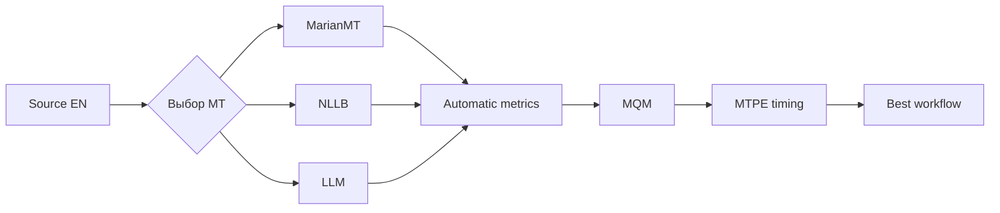

# Лабораторный практикум по дисциплине «Основы машинного перевода»

## Лабораторная работа 4. «Автоматические метрики (BLEU, chrF, COMET) и экспертная оценка постредактирования (MTPE / MQM)»

**Раздел курса:** 6  
**Максимум:** 20 баллов  
**Сквозной кейс:** сравнительная оценка MarianMT, NLLB и LLM-перевода локализуемого учебного модуля.

### Цель и формируемые компетенции (ОПК-2, ОПК-9, УК-1, УК-6)

**Цель** — построить воспроизводимый контур оценки качества машинного перевода, объединяющий автоматические метрики, экспертную разметку MQM и измерение трудозатрат на MTPE.

- **ОПК-2:** обоснованный выбор перевода для образовательного материала;
- **ОПК-9:** использование инструментов автоматического оценивания качества NLP;
- **УК-1:** критическая интерпретация метрик и экспертных ошибок;
- **УК-6:** оценка трудоемкости постредактирования и планирование workflow.

### Входные данные и подготовительные требования

Используйте один и тот же набор сегментов:

```text
data/source_en.md
data/reference_ru.md
lab02/results_marian.jsonl
lab02/results_nllb.jsonl
lab03/results_llm.jsonl
data/glossary.csv
```

Минимум — **12 сегментов**.

`reference_ru.md` должен быть создан и вычитан человеком до начала оценивания. Если студент сам создал reference, это явно указывается.

Установка:

```bash
pip install sacrebleu pandas
pip install unbabel-comet
```

COMET требует больше памяти, чем BLEU/chrF. Допускается выполнение COMET в доступной GPU-среде при сохранении кода и результатов в репозитории.

Официальные источники:

- sacreBLEU: <https://github.com/mjpost/sacrebleu>
- COMET: <https://github.com/Unbabel/COMET>
- MQM: <https://www.themqm.org/>
- MQM typology: <https://www.themqm.org/mqm-pillars/typology/>

### Пошаговое руководство к выполнению (с примерами кода на Python 3.10+ и инструкциями для Smartcat/API)

#### Шаг 1. Единый evaluation dataset

Создайте CSV:

```text
segment_id,source,reference,marian,nllb,llm
```

Проверка:

```python
import pandas as pd

df = pd.read_csv("lab04/evaluation_dataset.csv")

required = {
    "segment_id",
    "source",
    "reference",
    "marian",
    "nllb",
    "llm",
}

missing = required - set(df.columns)
assert not missing, f"Missing columns: {missing}"
assert df["segment_id"].is_unique
assert len(df) >= 12
```

Все модели оцениваются **на одних и тех же source/reference сегментах**.

#### Шаг 2. BLEU

```python
from sacrebleu.metrics import BLEU

bleu = BLEU()

reference = df["reference"].tolist()

systems = {
    "marian": df["marian"].tolist(),
    "nllb": df["nllb"].tolist(),
    "llm": df["llm"].tolist(),
}

for name, hypothesis in systems.items():
    score = bleu.corpus_score(
        hypothesis,
        [reference]
    )
    print(name, score)
    print("signature:", bleu.get_signature())
```

$$
BLEU =
BP \cdot
\exp\left(
\sum_{n=1}^{N} w_n \log p_n
\right).
$$

Основной вывод делайте по **корпусному** BLEU.

#### Шаг 3. chrF и chrF++

```python
from sacrebleu.metrics import CHRF

chrf = CHRF(word_order=0)
chrfpp = CHRF(word_order=2)

for name, hypothesis in systems.items():
    print(
        name,
        chrf.corpus_score(
            hypothesis,
            [reference]
        )
    )
```

chrF сравнивает символьные n-граммы и полезен при анализе морфологически богатого русского языка.

#### Шаг 4. Посегментные оценки

```python
rows = []

for _, row in df.iterrows():
    for system in ["marian", "nllb", "llm"]:
        b = bleu.sentence_score(
            row[system],
            [row["reference"]]
        ).score

        c = chrf.sentence_score(
            row[system],
            [row["reference"]]
        ).score

        rows.append({
            "segment_id": row["segment_id"],
            "system": system,
            "bleu_sentence": b,
            "chrf_sentence": c,
        })

segment_scores = pd.DataFrame(rows)
```

Sentence-BLEU используйте только как диагностический показатель, а не как единственный критерий.

#### Шаг 5. COMET

Reference-based COMET:

```python
from comet import download_model, load_from_checkpoint

model_path = download_model(
    "Unbabel/wmt22-comet-da"
)
model = load_from_checkpoint(model_path)

data = [
    {
        "src": row.source,
        "mt": row.llm,
        "ref": row.reference,
    }
    for row in df.itertuples(index=False)
]

output = model.predict(
    data,
    batch_size=8,
    gpus=1  # замените на 0 для CPU
)

print(output.system_score)
```

Повторите для MarianMT и NLLB.

Если API вашей версии COMET отличается, зафиксируйте версию и адаптируйте код по официальному README.

> Высокий COMET не заменяет экспертную проверку терминологии, модальности, кода и педагогической пригодности.

#### Шаг 6. Итоговая таблица метрик

Создайте:

| system | BLEU | chrF | chrF++ | COMET |
|---|---:|---:|---:|---:|
| MarianMT |  |  |  |  |
| NLLB |  |  |  |  |
| LLM |  |  |  |  |

Сохраните как `lab04/metrics.csv`.

#### Шаг 7. MQM: сокращенный профиль

В актуальном MQM верхний уровень включает категории Terminology, Accuracy, Linguistic conventions, Style, Locale conventions, Audience appropriateness и Design and markup.

Для лабораторной используйте профиль:

| Категория | Что фиксировать |
|---|---|
| Accuracy / Mistranslation | искажено значение |
| Accuracy / Omission | пропущена информация |
| Accuracy / Addition | добавлено отсутствующее |
| Terminology | неверный/несогласованный термин |
| Linguistic conventions / Grammar | грамматическая ошибка |
| Linguistic conventions / Spelling | орфографическая ошибка |
| Style | калька, неподходящий регистр |
| Audience appropriateness | текст плохо подходит студентам |
| Design and markup | повреждены Markdown, код, формула |

#### Шаг 8. Severity

Используйте:

- `minor` — требуется правка, но основной смысл не искажен;
- `major` — заметно нарушены смысл, терминология или пригодность;
- `critical` — сегмент неприемлем или опасно искажает информацию.

До разметки создайте `lab04/mqm_guideline.md` и опишите правила присвоения severity.

#### Шаг 9. MQM annotations

`lab04/mqm_annotations.csv`:

```csv
segment_id,system,error_type,severity,span,comment
s001,marian,Terminology,major,assignment,"Требуется «присваивание»"
s003,llm,Style,minor,,"Избыточно разговорная формулировка"
s007,nllb,Accuracy/Omission,major,,"Пропущено условие выполнения"
```

#### Шаг 10. Учебная числовая модель MQM

Для учебного эксперимента задайте **собственную явно объявленную** систему весов:

```python
WEIGHTS = {
    "minor": 1,
    "major": 5,
    "critical": 20,
}
```

```python
ann = pd.read_csv(
    "lab04/mqm_annotations.csv"
)

ann["penalty"] = ann["severity"].map(
    WEIGHTS
)

summary = (
    ann.groupby("system")["penalty"]
       .sum()
       .sort_values()
)

print(summary)
```

Это **учебная конфигурация**, а не «единственная официальная формула MQM».

Нормирование:

$$
MQM_{penalty/1000}
=
\frac{\sum_i w_i}{N_{words}}
\cdot 1000.
$$

#### Шаг 11. MTPE и время

`lab04/postediting_time.csv`:

```csv
segment_id,system,seconds,words,edited
s001,marian,42,11,1
s001,nllb,35,11,1
s001,llm,18,11,1
```

Скорость:

$$
WPH =
\frac{N_{words}}{T_{hours}}.
$$

Оценка человеко-часов:

$$
H =
\frac{N}{WPH}.
$$

```python
pe = pd.read_csv(
    "lab04/postediting_time.csv"
)

summary = (
    pe.groupby("system")
      .agg(
          seconds=("seconds", "sum"),
          words=("words", "sum"),
      )
)

summary["hours"] = summary["seconds"] / 3600
summary["wph"] = (
    summary["words"] / summary["hours"]
)

print(summary)
```

#### Шаг 12. Итоговая сравнительная таблица

| Система | BLEU ↑ | chrF ↑ | COMET ↑ | MQM penalty ↓ | WPH ↑ |
|---|---:|---:|---:|---:|---:|
| MarianMT |  |  |  |  |  |
| NLLB |  |  |  |  |  |
| LLM |  |  |  |  |  |

Обязательно разберите минимум два случая расхождения между автоматической и экспертной оценкой.

Примеры:

1. BLEU предпочел A, эксперт — B;
2. высокий BLEU потребовал больше постредактирования;
3. LLM улучшил стиль, но нарушил терминологию;
4. NMT дал менее беглый, но более точный перевод.

#### Шаг 13. Корреляция как дополнительный анализ

Если подготовлена посегментная MQM-таблица:

```python
merged = segment_scores.merge(
    mqm_segment_penalties,
    on=["segment_id", "system"]
)

print(
    merged[
        ["chrf_sentence", "mqm_penalty"]
    ].corr(method="spearman")
)
```

При 12–20 сегментах результат интерпретируется только как учебная диагностика.

#### Шаг 14. Выбор производственного workflow

Финальный выбор делайте по совокупности:

- accuracy;
- terminology;
- сохранение кода/Markdown;
- педагогическая понятность;
- MTPE effort;
- reproducibility;
- конфиденциальность;
- доступность инфраструктуры.

Пример:



### Задания для самостоятельного выполнения (3-4 варианта)

#### Вариант 1. Variables and Data Types
Особенно анализируйте `value`, `assignment`, `object`, `string`.

#### Вариант 2. Conditional Statements
Особое внимание уделите логической модальности, `condition`, `branch`, `statement`, отрицанию.

#### Вариант 3. Loops and Iteration
В MQM отдельно фиксируйте повреждение кода и Python keywords.

#### Вариант 4. Functions and Parameters
Проверьте разграничение `argument`, `parameter`, `return`, `scope`.

Для любого варианта обязательно:

1. BLEU;
2. chrF;
3. COMET;
4. MQM по 12+ сегментам × 3 системы;
5. минимум 15 MQM-ошибок суммарно либо обоснование меньшего числа;
6. MTPE timing минимум по 6 сегментам каждой системы;
7. итоговый сравнительный вывод.

### Требования к оформлению отчета в GitHub-репозитории

```text
lab04/
├── evaluation_dataset.csv
├── evaluate.py
├── metrics.csv
├── mqm_guideline.md
├── mqm_annotations.csv
├── postediting_time.csv
└── report.md
```

`report.md`:

1. описание reference;
2. версии sacreBLEU и COMET;
3. metric signatures sacreBLEU;
4. BLEU/chrF/COMET;
5. профиль MQM и severity;
6. 8+ подробно разобранных ошибок;
7. расчет MTPE;
8. automatic vs human;
9. выбор лучшего workflow;
10. ограничения.

### Детализированный критериальный лист оценки (Рубрикатор на 20 баллов):

| Критерий | Состав критерия | Баллы |
|---|---|---:|
| **Работоспособность пайплайна/кода** | BLEU/chrF — 2; COMET — 2; MQM/MTPE — 2 | **6** |
| **Корректность лингвистической обработки и валидации** | Единый test set/reference — 1; корректный MQM-профиль — 2; expert annotation — 2 | **5** |
| **Анализ ошибок и аргументация решений** | 8+ примеров — 2; automatic vs human — 2; выбор workflow — 1 | **5** |
| **Оформление репозитория, reproducibility** | Данные/скрипты — 1; версии/signatures — 1; README/requirements — 1; воспроизводимость — 1 | **4** |
| **Итого** |  | **20** |
