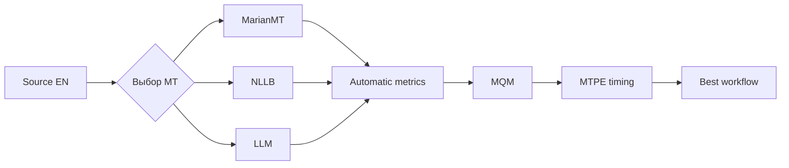

# Лабораторный практикум по дисциплине «Основы машинного перевода»

## Лабораторная работа 4. «Автоматические метрики (BLEU, chrF, COMET) и экспертная оценка постредактирования (MTPE / MQM)»

**Раздел курса:** 6  
**Максимум:** 20 баллов  
**Сквозной кейс:** сравнительная оценка MarianMT, NLLB и LLM-перевода локализуемого учебного модуля.

### Цель и формируемые компетенции (ОПК-2, ОПК-9, УК-1, УК-6)

**Цель** — построить воспроизводимый контур оценки качества машинного перевода, объединяющий автоматические метрики, экспертную разметку MQM и измерение трудозатрат на MTPE.

- **ОПК-2:** обоснованный выбор перевода для образовательного материала;
- **ОПК-9:** использование инструментов автоматического оценивания качества NLP;
- **УК-1:** критическая интерпретация метрик и экспертных ошибок;
- **УК-6:** оценка трудоемкости постредактирования и планирование workflow.

### Задачи лабораторной работы

В ходе работы необходимо:

1. сформировать единый evaluation dataset для трех систем перевода;
2. рассчитать корпусные BLEU, chrF и chrF++;
3. выполнить reference-based COMET на том же наборе сегментов;
4. получить посегментные диагностические оценки;
5. разработать и применить сокращенный MQM-профиль;
6. выполнить экспертную разметку ошибок и severity;
7. рассчитать нормированный MQM penalty;
8. измерить трудозатраты на MTPE и скорость WPH;
9. сопоставить автоматические и экспертные оценки;
10. разобрать минимум два случая расхождения automatic vs human;
11. выполнить учебный корреляционный анализ;
12. обосновать выбор итогового production workflow.

### Инструменты

| Инструмент | Назначение |
|---|---|
| **Python 3.10+** | расчеты и автоматизация evaluation pipeline |
| **JupyterLab / Google Colab** | воспроизводимый эксперимент |
| **pandas** | подготовка evaluation dataset, MQM и MTPE таблиц |
| **sacreBLEU** | BLEU, chrF, chrF++, metric signatures |
| **COMET / `Unbabel/wmt22-comet-da`** | reference-based neural evaluation |
| **MQM** | экспертная типология переводческих ошибок |
| **CSV / JSONL** | обмен результатами ЛР № 2–3 |
| **Git / GitHub** | версия кода, данных, guideline и отчета |
| **Результаты ЛР № 1–3** | source/reference, glossary, MarianMT, NLLB и LLM outputs |

Автоматические метрики не заменяют экспертную оценку. Все три системы должны оцениваться **на одном и том же наборе source/reference сегментов**.

### Входные данные и подготовительные требования

Используйте один и тот же набор сегментов и результаты предыдущих лабораторных работ:

```text
data/source_en.md
data/reference_ru.md
data/glossary.csv
lab02/results/results_marian.jsonl
lab02/results/results_nllb.jsonl
lab03/results/results_llm.jsonl
```

В ЛР № 4 студент продолжает **тот же индивидуальный вариант**, который выполнял в ЛР № 1–3.

| Вариант | Тема учебного модуля |
|---:|---|
| 1 | Variables and Data Types |
| 2 | Conditional Statements |
| 3 | Loops and Iteration |
| 4 | Functions and Parameters |
| 5 | Lists, Tuples and Sequence Operations |
| 6 | Dictionaries and Sets |
| 7 | File Input and Output |
| 8 | Classes and Objects |
| 9 | Exceptions and Error Handling |
| 10 | Modules, Packages and Imports |

**Вариант 11 — Algorithms and Computational Complexity** является полностью решенным демонстрационным вариантом преподавателя и студентам как индивидуальное задание не назначается.

Минимум — **12 одинаковых сегментов для всех трех систем**.

`reference_ru.md` должен быть создан и вычитан человеком до начала оценивания. Если студент сам создал reference, это явно указывается.

Установка:

```bash
pip install sacrebleu pandas
pip install unbabel-comet
```

COMET требует больше памяти, чем BLEU/chrF. Допускается выполнение COMET в доступной GPU-среде при сохранении кода и результатов в репозитории.

Официальные источники:

- sacreBLEU: <https://github.com/mjpost/sacrebleu>
- COMET: <https://github.com/Unbabel/COMET>
- MQM: <https://www.themqm.org/>
- MQM typology: <https://www.themqm.org/mqm-pillars/typology/>

### Пошаговое руководство к выполнению (с примерами кода на Python 3.10+ и инструкциями для Smartcat/API)

#### Шаг 1. Единый evaluation dataset

Создайте CSV:

```text
segment_id,source,reference,marian,nllb,llm
```

Проверка:

```python
import pandas as pd

df = pd.read_csv("lab04/evaluation_dataset.csv")

required = {
    "segment_id",
    "source",
    "reference",
    "marian",
    "nllb",
    "llm",
}

missing = required - set(df.columns)
assert not missing, f"Missing columns: {missing}"
assert df["segment_id"].is_unique
assert len(df) >= 12
```

Все модели оцениваются **на одних и тех же source/reference сегментах**.

#### Шаг 2. BLEU

```python
from sacrebleu.metrics import BLEU

bleu = BLEU()

reference = df["reference"].tolist()

systems = {
    "marian": df["marian"].tolist(),
    "nllb": df["nllb"].tolist(),
    "llm": df["llm"].tolist(),
}

for name, hypothesis in systems.items():
    score = bleu.corpus_score(
        hypothesis,
        [reference]
    )
    print(name, score)
    print("signature:", bleu.get_signature())
```

```math
BLEU
=
BP \cdot
\exp\left(
\sum_{n=1}^{N} w_n \log p_n
\right).
```

Основной вывод делайте по **корпусному** BLEU.

#### Шаг 3. chrF и chrF++

```python
from sacrebleu.metrics import CHRF

chrf = CHRF(word_order=0)
chrfpp = CHRF(word_order=2)

for name, hypothesis in systems.items():
    print(
        name,
        chrf.corpus_score(
            hypothesis,
            [reference]
        )
    )
```

chrF сравнивает символьные n-граммы и полезен при анализе морфологически богатого русского языка.

#### Шаг 4. Посегментные оценки

```python
rows = []

for _, row in df.iterrows():
    for system in ["marian", "nllb", "llm"]:
        b = bleu.sentence_score(
            row[system],
            [row["reference"]]
        ).score

        c = chrf.sentence_score(
            row[system],
            [row["reference"]]
        ).score

        rows.append({
            "segment_id": row["segment_id"],
            "system": system,
            "bleu_sentence": b,
            "chrf_sentence": c,
        })

segment_scores = pd.DataFrame(rows)
```

Sentence-BLEU используйте только как диагностический показатель, а не как единственный критерий.

#### Шаг 5. COMET

Reference-based COMET:

```python
from comet import download_model, load_from_checkpoint

model_path = download_model(
    "Unbabel/wmt22-comet-da"
)
model = load_from_checkpoint(model_path)

data = [
    {
        "src": row.source,
        "mt": row.llm,
        "ref": row.reference,
    }
    for row in df.itertuples(index=False)
]

output = model.predict(
    data,
    batch_size=8,
    gpus=1  # замените на 0 для CPU
)

print(output.system_score)
```

Повторите для MarianMT и NLLB.

Если API вашей версии COMET отличается, зафиксируйте версию и адаптируйте код по официальному README.

> Высокий COMET не заменяет экспертную проверку терминологии, модальности, кода и педагогической пригодности.

#### Шаг 6. Итоговая таблица метрик

Создайте:

| system | BLEU | chrF | chrF++ | COMET |
|---|---:|---:|---:|---:|
| MarianMT |  |  |  |  |
| NLLB |  |  |  |  |
| LLM |  |  |  |  |

Сохраните как `lab04/metrics.csv`.

#### Шаг 7. MQM: сокращенный профиль

В актуальном MQM верхний уровень включает категории Terminology, Accuracy, Linguistic conventions, Style, Locale conventions, Audience appropriateness и Design and markup.

Для лабораторной используйте профиль:

| Категория | Что фиксировать |
|---|---|
| Accuracy / Mistranslation | искажено значение |
| Accuracy / Omission | пропущена информация |
| Accuracy / Addition | добавлено отсутствующее |
| Terminology | неверный/несогласованный термин |
| Linguistic conventions / Grammar | грамматическая ошибка |
| Linguistic conventions / Spelling | орфографическая ошибка |
| Style | калька, неподходящий регистр |
| Audience appropriateness | текст плохо подходит студентам |
| Design and markup | повреждены Markdown, код, формула |

#### Шаг 8. Severity

Используйте:

- `minor` — требуется правка, но основной смысл не искажен;
- `major` — заметно нарушены смысл, терминология или пригодность;
- `critical` — сегмент неприемлем или опасно искажает информацию.

До разметки создайте `lab04/mqm_guideline.md` и опишите правила присвоения severity.

#### Шаг 9. MQM annotations

`lab04/mqm_annotations.csv`:

```csv
segment_id,system,error_type,severity,span,comment
s001,marian,Terminology,major,assignment,"Требуется «присваивание»"
s003,llm,Style,minor,,"Избыточно разговорная формулировка"
s007,nllb,Accuracy/Omission,major,,"Пропущено условие выполнения"
```

#### Шаг 10. Учебная числовая модель MQM

Для учебного эксперимента задайте **собственную явно объявленную** систему весов:

```python
WEIGHTS = {
    "minor": 1,
    "major": 5,
    "critical": 20,
}
```

```python
ann = pd.read_csv(
    "lab04/mqm_annotations.csv"
)

ann["penalty"] = ann["severity"].map(
    WEIGHTS
)

summary = (
    ann.groupby("system")["penalty"]
       .sum()
       .sort_values()
)

print(summary)
```

Это **учебная конфигурация**, а не «единственная официальная формула MQM».

Нормирование:

```math
MQM_{penalty/1000}
=
\frac{\sum_i w_i}{N_{words}}
\cdot 1000.
```

#### Шаг 11. MTPE и время

`lab04/postediting_time.csv`:

```csv
segment_id,system,seconds,words,edited
s001,marian,42,11,1
s001,nllb,35,11,1
s001,llm,18,11,1
```

Скорость:

```math
WPH
=
\frac{N_{words}}{T_{hours}}.
```

Оценка человеко-часов:

```math
H
=
\frac{N}{WPH}.
```

```python
pe = pd.read_csv(
    "lab04/postediting_time.csv"
)

summary = (
    pe.groupby("system")
      .agg(
          seconds=("seconds", "sum"),
          words=("words", "sum"),
      )
)

summary["hours"] = summary["seconds"] / 3600
summary["wph"] = (
    summary["words"] / summary["hours"]
)

print(summary)
```

#### Шаг 12. Итоговая сравнительная таблица

| Система | BLEU ↑ | chrF ↑ | COMET ↑ | MQM penalty ↓ | WPH ↑ |
|---|---:|---:|---:|---:|---:|
| MarianMT |  |  |  |  |  |
| NLLB |  |  |  |  |  |
| LLM |  |  |  |  |  |

Обязательно разберите минимум два случая расхождения между автоматической и экспертной оценкой.

Примеры:

1. BLEU предпочел A, эксперт — B;
2. высокий BLEU потребовал больше постредактирования;
3. LLM улучшил стиль, но нарушил терминологию;
4. NMT дал менее беглый, но более точный перевод.

#### Шаг 13. Корреляция как дополнительный анализ

Если подготовлена посегментная MQM-таблица:

```python
merged = segment_scores.merge(
    mqm_segment_penalties,
    on=["segment_id", "system"]
)

print(
    merged[
        ["chrf_sentence", "mqm_penalty"]
    ].corr(method="spearman")
)
```

При 12–20 сегментах результат интерпретируется только как учебная диагностика.

#### Шаг 14. Выбор производственного workflow

Финальный выбор делайте по совокупности:

- accuracy;
- terminology;
- сохранение кода/Markdown;
- педагогическая понятность;
- MTPE effort;
- reproducibility;
- конфиденциальность;
- доступность инфраструктуры.

Пример:



### Задания для самостоятельного выполнения (10 индивидуальных вариантов + вариант 11 как эталон)

Для вариантов 1–10 используется тот же учебный модуль и те же сегменты, что и в ЛР № 1–3.

Для любого индивидуального варианта обязательно:

1. единый evaluation dataset минимум из **12 сегментов × 3 системы**;
2. corpus BLEU;
3. chrF;
4. chrF++;
5. COMET;
6. metric signatures sacreBLEU;
7. сокращенный MQM-профиль и собственный `mqm_guideline.md`;
8. экспертная MQM-разметка трех систем;
9. минимум **15 MQM-ошибок суммарно** либо аргументированное обоснование меньшего числа;
10. минимум **8 подробно разобранных ошибок**;
11. MTPE timing минимум по **6 сегментам каждой системы**;
12. минимум **2 расхождения automatic vs human**;
13. дополнительный посегментный корреляционный анализ;
14. итоговый выбор workflow.

#### Вариант 1. Variables and Data Types

Особое внимание при MQM: `value`, `assignment`, `object`, `string`, `data type`, `type conversion`.

Проверьте, не дает ли высокая автоматическая метрика ложного преимущества варианту с нарушением preferred terminology.

#### Вариант 2. Conditional Statements

Особое внимание: `condition`, `branch`, `statement`, `else clause`, отрицание и логическая модальность.

Для MQM отдельно отмечайте ошибки, меняющие условие выполнения ветви.

#### Вариант 3. Loops and Iteration

Особое внимание: `loop`, `iteration`, `range`, `break`, `continue`.

В категории `Design and markup` отдельно фиксируйте повреждение Python keywords и code fragments.

#### Вариант 4. Functions and Parameters

Особое внимание: `function`, `parameter`, `argument`, `return value`, `scope`.

Отдельно оцените ошибки разграничения `argument` / `parameter`.

#### Вариант 5. Lists, Tuples and Sequence Operations

Особое внимание: `list`, `tuple`, `sequence`, `index`, `slice`, `mutable`, `immutable`.

Проверьте сохранение индексов, срезов и Python-выражений.

#### Вариант 6. Dictionaries and Sets

Особое внимание: `dictionary`, `key`, `value`, `mapping`, `set`, `hash`, `lookup`, `intersection`, `union`.

Отдельно анализируйте контекстно зависимые `key`, `mapping` и `set`.

#### Вариант 7. File Input and Output

Особое внимание: `file`, `stream`, `file path`, `encoding`, `read mode`, `write mode`, `file handle`.

В MQM отдельно фиксируйте повреждение путей, расширений и режимов открытия файлов.

#### Вариант 8. Classes and Objects

Особое внимание: `class`, `object`, `instance`, `attribute`, `method`, `constructor`, `inheritance`.

Сравните автоматические метрики с экспертной оценкой терминологии ООП.

#### Вариант 9. Exceptions and Error Handling

Особое внимание: `exception`, `error`, `raise`, `try block`, `except block`, `finally block`, `traceback`.

Ошибки в Python keywords относятся также к сохранению кода/markup.

#### Вариант 10. Modules, Packages and Imports

Особое внимание: `module`, `package`, `import`, `namespace`, `library`, `dependency`, `virtual environment`.

Проверьте, не переводит ли система import paths, package names и identifiers.

### Вариант 11. Полностью решенный тестовый пример

**Тема:** `Algorithms and Computational Complexity`.

Вариант 11 продолжает демонстрационные варианты 11 из ЛР № 1–3.

Комплект:

- [`variant_11_solution/README.md`](variant_11_solution/README.md);
- [`variant_11_solution/LAB_04_VARIANT_11_SOLUTION.ipynb`](variant_11_solution/LAB_04_VARIANT_11_SOLUTION.ipynb);
- [`variant_11_solution/LAB_04_VARIANT_11_SOLUTION_EXECUTED.ipynb`](variant_11_solution/LAB_04_VARIANT_11_SOLUTION_EXECUTED.ipynb);
- [`variant_11_solution/evaluate.py`](variant_11_solution/evaluate.py) — live sacreBLEU/COMET;
- [`variant_11_solution/evaluate_reference.py`](variant_11_solution/evaluate_reference.py) — offline reference pipeline;
- [`variant_11_solution/mqm_guideline.md`](variant_11_solution/mqm_guideline.md);
- [`variant_11_solution/report.md`](variant_11_solution/report.md);
- [`variant_11_solution/data/evaluation_dataset_fixture.csv`](variant_11_solution/data/evaluation_dataset_fixture.csv);
- [`variant_11_solution/results/metrics_reference.csv`](variant_11_solution/results/metrics_reference.csv);
- [`variant_11_solution/results/segment_scores_reference.csv`](variant_11_solution/results/segment_scores_reference.csv);
- [`variant_11_solution/results/mqm_annotations.csv`](variant_11_solution/results/mqm_annotations.csv);
- [`variant_11_solution/results/mqm_summary.csv`](variant_11_solution/results/mqm_summary.csv);
- [`variant_11_solution/results/postediting_time_fixture.csv`](variant_11_solution/results/postediting_time_fixture.csv);
- [`variant_11_solution/results/mtpe_summary.csv`](variant_11_solution/results/mtpe_summary.csv);
- [`variant_11_solution/results/comparison_reference.csv`](variant_11_solution/results/comparison_reference.csv);
- [`variant_11_solution/results/correlation_reference.csv`](variant_11_solution/results/correlation_reference.csv);
- [`variant_11_solution/requirements.txt`](variant_11_solution/requirements.txt).

#### Важное различие reference и live

В эталонном dataset переводы `marian`, `nllb`, `llm` являются **преподавательским fixture**, а не скрытыми результатами фактического запуска моделей. Это позволяет полностью выполнить MQM/MTPE и методический анализ без подмены происхождения данных.

Реальные BLEU/chrF/chrF++ и COMET для студенческой сдачи рассчитываются на фактических результатах ЛР № 2–3:

```bash
python evaluate.py --dataset data/evaluation_dataset_live.csv --comet --gpus 0
```

Для GPU параметр `--gpus` адаптируется к конкретной среде.

В demonstrational fixture получается важное расхождение:

- NLLB немного выше по offline BLEU/chrF;
- LLM получает меньший экспертный MQM penalty;
- LLM требует меньше демонстрационного времени постредактирования.

Поэтому эталон показывает, почему выбор workflow нельзя делать только по BLEU.

### Требования к оформлению отчета в GitHub-репозитории

```text
lab04/
├── LAB_04.ipynb
├── data/
│   └── evaluation_dataset.csv
├── results/
│   ├── metrics.csv
│   ├── segment_scores.csv
│   ├── mqm_annotations.csv
│   ├── mqm_summary.csv
│   ├── postediting_time.csv
│   └── comparison.csv
├── evaluate.py
├── mqm_guideline.md
├── report.md
├── requirements.txt
└── README.md
```

`report.md`:

1. описание reference;
2. версии sacreBLEU и COMET;
3. metric signatures sacreBLEU;
4. BLEU/chrF/COMET;
5. профиль MQM и severity;
6. 8+ подробно разобранных ошибок;
7. расчет MTPE;
8. automatic vs human;
9. выбор лучшего workflow;
10. ограничения.

### Детализированный критериальный лист оценки (Рубрикатор на 20 баллов):

| Критерий | Состав критерия | Баллы |
|---|---|---:|
| **Работоспособность пайплайна/кода** | BLEU/chrF — 2; COMET — 2; MQM/MTPE — 2 | **6** |
| **Корректность лингвистической обработки и валидации** | Единый test set/reference — 1; корректный MQM-профиль — 2; expert annotation — 2 | **5** |
| **Анализ ошибок и аргументация решений** | 8+ примеров — 2; automatic vs human — 2; выбор workflow — 1 | **5** |
| **Оформление репозитория, reproducibility** | Данные/скрипты — 1; версии/signatures — 1; README/requirements — 1; воспроизводимость — 1 | **4** |
| **Итого** |  | **20** |
